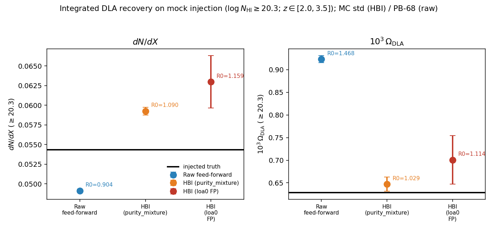
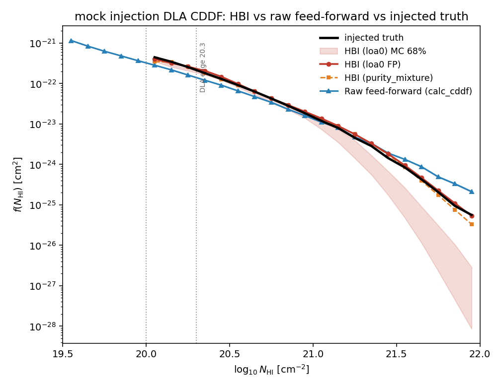

# `CDDF_analysis/hbi/` — Catalog-HBI DLA measurement

For the shortest runnable path from a frozen catalog to a dN/dX/Omega/f(N) band,
see **[QUICKSTART.md](QUICKSTART.md)**.

The **catalog-HBI** estimator turns a GP-DLA detection catalog into a
selection-corrected DLA population measurement — the column-density distribution
**f(N_HI)**, the line density **dN/dX**, and **Ω_DLA** — using a GW-style
rate-form (marked-Poisson) hierarchical Bayesian model that deconvolves the
measurement kernel and subtracts the false-positive rate.

## Discipline

- **Reduce-only.** The pipeline reuses the *frozen* GP posteriors byte-for-byte.
  No inference code is touched (`gpy_dla_detection/dla_gp.py`,
  `run_bayes_select.py`, `dlasearch.py` are never modified) and there is **zero
  re-inference**.
- **Mock figures only in-repo.** The figures here are from a **mock-injection
  validation** (truth known). Real-survey figures and numbers are not committed.

## Headline result (mock-injection validation)

On a mock-injection test (DLA truth known), the catalog-HBI estimator recovers
the injected DLA population, and in particular corrects the two failure modes of
a raw feed-forward (uncorrected-posterior) measurement: the **incompleteness
deficit** in dN/dX and the **Ω over-statement** from the uncorrected high-N_HI
posterior tail.

|  |  |
|:--:|:--:|
| Integrated dN/dX & Ω_DLA: HBI vs raw feed-forward vs injected truth | Differential f(N_HI): the high-N tail HBI re-steepens |

- `figures/fig_compare_integrated.png` — integrated dN/dX and Ω_DLA for both HBI
  FP variants vs the raw feed-forward vs the injected truth, with R0 (=
  method/truth) annotated.
- `figures/fig_compare_fN.png` — the differential f(N_HI): the raw feed-forward
  tail is too flat (drives the Ω over-statement); HBI's kernel deconvolution
  re-steepens it.

> **What the mock validates — and what it does NOT.** The on-mock R0 ≈ 1
> ("recovers truth to ~3–9%") is a **self-consistency** check, *not* an
> external-calibration claim. The completeness / kernel correction is fit on the
> *same* mock's truth, so by construction the corrected estimate is pulled toward
> that truth — the residual α = 1/R0 → 1 is a near-**tautology**. This demonstrates
> the estimator's internal machinery (kernel deconvolution + FP subtraction + the
> marginalized band) is arithmetically sound; it does **not** prove the calibration
> *transfers*. The real, non-circular test is **cross-mock**: build the
> kernel/completeness on one mock and check α(z) ≈ 1 on a *held-out* mock or survey
> (London, Saclay, real LOA) **without refitting**. That cross-mock validation is
> **not in this PR**. Treat the mock R0 as self-consistency; treat the cross-mock /
> real-LOA literature agreement as the calibration evidence.

## Uncertainty budget (read before quoting an error bar)

The HBI MC band is a **statistical** band only — label it "statistical (indep. MC)".
A 3-referee stat-panel audit (re-running the band machinery on the 2LPT-0 mock)
established:

- **The statistical band is correctly sized**, not under-dispersed: the dN/dX and
  f(N) 68% half-widths are ~2–3× the irreducible Poisson floor, MC-converged
  (use `n_mc ≥ 240`), and ~1.2–1.6× wider than a plain sightline bootstrap. It
  carries the truth-match bootstrap (C/ρ/g), the inner Laplace, the per-object
  N_HI width, and the kernel-calibration MC.
- **It is NOT the total uncertainty.** For a science claim, combine in quadrature:

  | term | dN/dX | Ω |
  |---|---|---|
  | statistical band (this MC) | ~0.7–1.7% | ~1% |
  | model-shape / B-spline penalty (λ) | **≈ band-sized (→ ~√2× wider)** | <1% (shape-robust) |
  | mean-flux | 1–2% | 1–2% |
  | high-N tail / shoulder deficit (one-sided) | mostly cancels (R0≈0.94) | **~11%** |
  | **σ_tot (rough)** | **±15–17%** | **±12%** |

  Under σ_tot, literature anchors that differ from each other by ~15% are mutually
  consistent at <1σ — a ~1% statistical band cannot envelope them, by construction.

- **Two caveats the band does NOT absorb:**
  1. **High-N tail bias (one-sided).** On-mock the MAP under-recovers the high-N
     end (R0 0.92→0.95 at logN 20.4–20.9, falling to **0.68→0.40 at logN ≳ 21.6** —
     the prior-ceiling / forward-kernel deep-tail systematic). It is a *bias*, not
     scatter: the true f(N) lies **above** the plotted high-N points. Do not widen
     the band to "cover" it — reduce/flag it.
  2. **Ω deep-tail slope-extrap over-inflation.** With `omega_slope_extrap` on
     (σ_slope=0.5) the Ω band is inflated ~100× and its coverage is uninformative;
     the Ω point itself is ~11% biased low. Do not cite Ω band coverage as
     unbiasedness evidence.

- **f(N) band centering.** The differential f(N) band is recentered on the plug-in
  MAP point (`band_recenter`, the same first-order Jensen correction as the
  integrated dN/dX/Ω); without it the band floats ~17.5% above the line.

## Full documentation

The end-to-end tutorial (runnable notebook + script), the complete reporting
conventions and known limitations, the synthesis reducer, and the per-mock
figures live in the **private analysis-notes repository** (not in this public
code repo), under `hbi/`.

## Code referenced (not modified)

| module | role |
|---|---|
| `CDDF_analysis/hbi/cddf_catalog_hbi.py` | the catalog-HBI estimator (1/Vmax + FP subtraction + marked-Poisson MAP fit) |
| `CDDF_analysis/hbi/run_phase3d_postkernel.py` | stage runner (kernel build, point fit, tilt-closure gate) |
| `CDDF_analysis/calc_cddf.py` | raw feed-forward (uncorrected) baseline |
