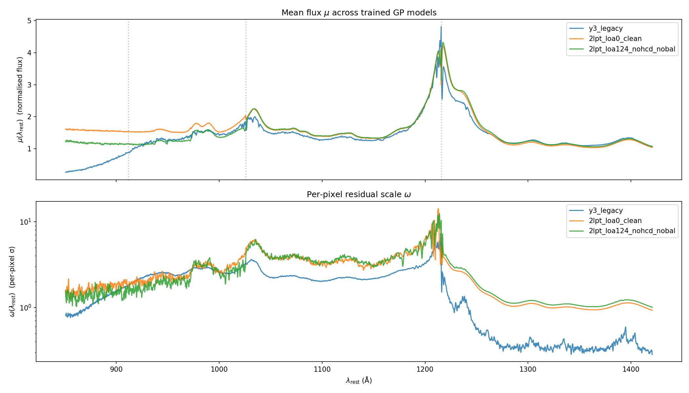
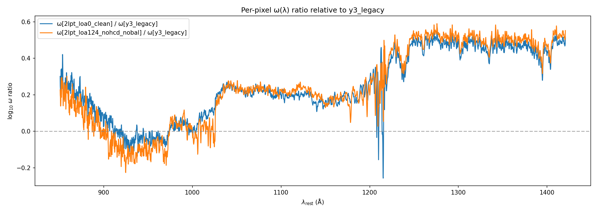
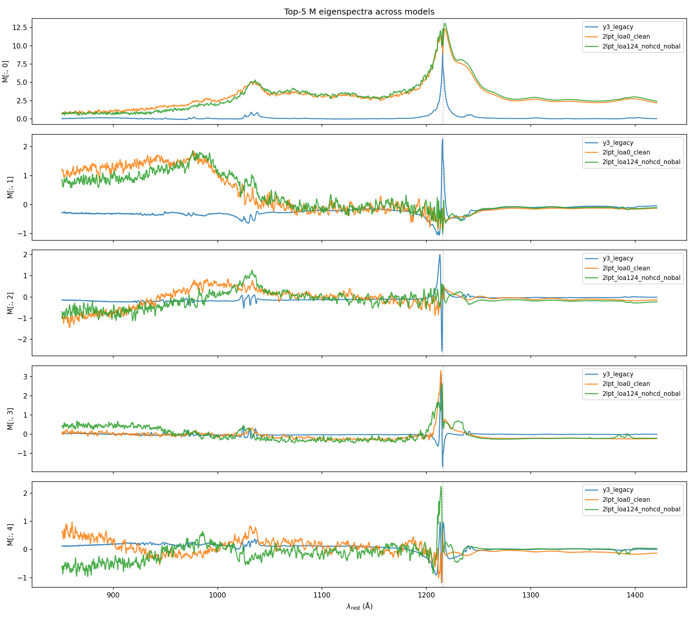
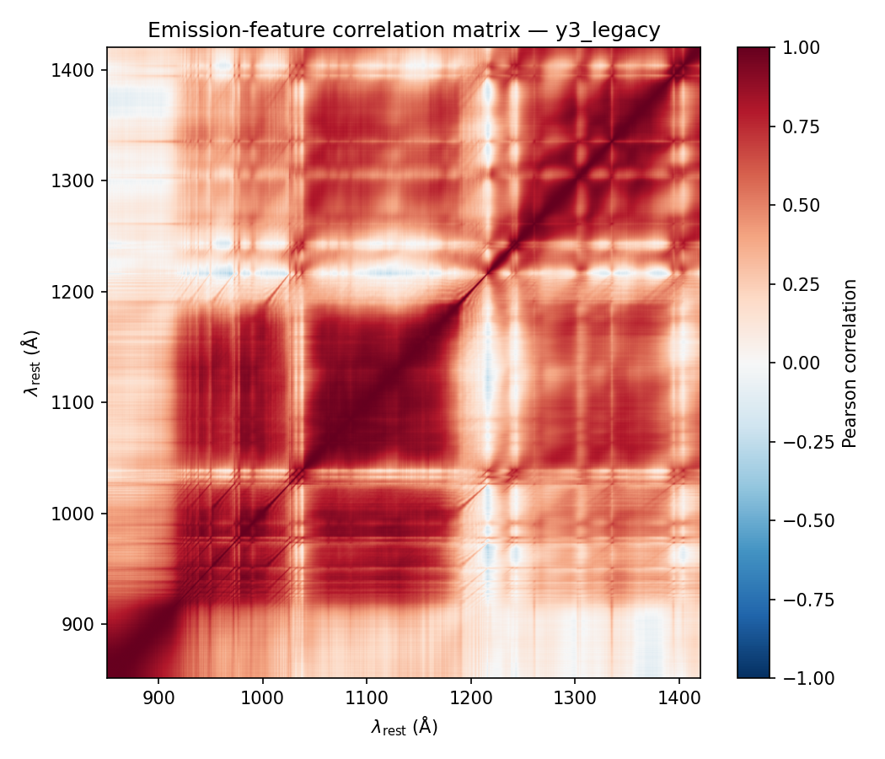
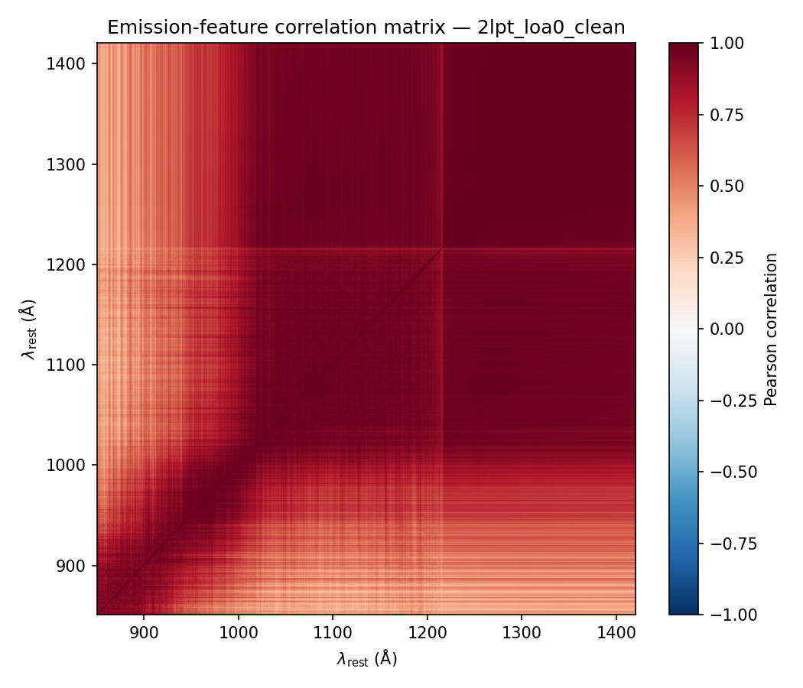
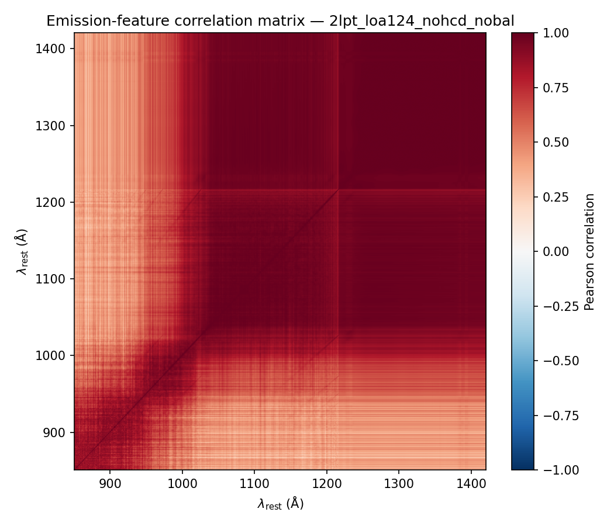

# 3-way GP model visualization: legacy Y3 vs v2 2LPT (loa-0 / loa-124 + filters)

Run on 2026-04-28 with `examples/diagnose_trained_gp.py visualize`.
All three models use the same architecture (k=30 PCA components, log-space
hyperparameters τ₀, β, c₀, μ, M, ω); only the training data and trainer
differ.

| tag | source | training data | trainer |
|---|---|---|---|
| `y3_legacy` | `learnlogs/model_epoch_920.h5` | LOA real data, "non-BAL non-DLA" pre-filtered | legacy (manual gradients, including the approximate `dlog_beta` documented in PR #4) |
| `2lpt_loa0_clean` | GreatLakes job 48881057, epoch 199 | 2LPT loa-0 (uncontaminated by mock construction — pure continuum + Lyα forest) | v2 (autograd backward, vectorised NLL) |
| `2lpt_loa124_nohcd_nobal` | GreatLakes job 48914328, epoch 199 | 2LPT loa-124 with HCDs (logNHI ≥ 17) and BALs (BI_CIV > 0) anti-joined out via the truth catalogs | v2 (autograd backward) |

50,000 spectra each, 200 epochs, Adam lr=5e-3, cosine schedule.

## Hyperparameter summary

| tag | τ₀ | β | c₀ |
|---|---:|---:|---:|
| `y3_legacy` | 0.00210 | **2.41** | 0.174 |
| `2lpt_loa0_clean` | 0.00218 | 3.423 | 0.041 |
| `2lpt_loa124_nohcd_nobal` | 0.00225 | 3.394 | 0.042 |

DESI Y1 prior on β is **N(3.62, 0.04)** (Turner+2024). The legacy Y3 trained
β = 2.41 sits **30σ below the prior mean** — i.e. the prior gradient should
have anchored it strongly, but in practice it didn't. The v2 2LPT models
sit ~6σ below the prior, also data-pulled but consistent with each other
and much closer to 3.62. Two non-exclusive explanations for the legacy
gap:

1. **Approximate `dlog_beta` gradient** in `objective.spectrum_loss` line 188
   (PR #4 finding) substitutes `log(lyα_1pz)` for the per-line
   `log(lyman_1pz_i)`. Each Lyman series term contributes a different
   gradient direction for β; collapsing them all to the Lyα log changes
   the effective β optimum.
2. **Real LOA forest physics differs from 2LPT physics**: τ_eff at z ≈ 2–4
   in real DESI is set by complex IGM + galactic absorbers + flux
   calibration; mocks use a clean prescription that's actually closer to
   Turner+2024.

It is _very_ likely (1) is the dominant factor for the legacy gap because
the v2 models — same data physics, different gradient — give β within
0.2 of each other. A side-by-side retrain of legacy on 2LPT (or v2 on
real LOA) would cleanly attribute it. That's task #20.

The c₀ difference (0.174 vs 0.04) is ~4× and follows the same direction:
legacy has a much larger absorption-noise scaling, again consistent with
data-pull beyond the prior.

---

## μ(λ) and ω(λ) overlay



**Top panel — μ(λ_rest)**: this is the GP-predicted **mean QSO flux**
post-de-forest, the centre around which the GP places fluctuations.

- All three models agree at the **Lyα emission line** (1216 Å) and the
  shape of the three-line emission complex (Lyβ 1026, Lyγ 973, Lyδ 950)
  is recognisable in all three. **2LPT** (orange and green) has a
  noticeably **sharper Lyα peak** (~4.5 normalised units) than legacy
  Y3 (~2.5 units) — mocks have less spectrum-to-spectrum emission-line
  variability so the **mean** is closer to a typical individual peak.
- Below ~950 Å, **legacy Y3 dips down to ≈ 0.5** (heavy mean
  absorption from real-data Lyman-limit systems, partial LLS, and
  Lyman-series continuum that the simple `exp(-τ_eff)` de-forest can't
  remove). **2LPT** stays at ≈ 1.0 because the mock generator doesn't
  embed those features beyond what `effective_optical_depth` already
  models.
- The **two 2LPT models almost coincide** across the whole range —
  the HCD/BAL anti-join removes a small fraction of contaminated
  sightlines but the residual μ shape is dominated by mock physics
  rather than catalogued absorbers.

**Bottom panel — ω(λ_rest), log scale**: per-pixel residual amplitude
that the GP allows around `μ(λ) · exp(-τ_eff)`.

- All three peak at ≈ 1216 Å — Lyα emission has the largest
  spectrum-to-spectrum spread, so the GP needs the largest residual
  budget there.
- **2LPT models have ~2–3× larger ω in the side band** (λ_rest > 1216 Å)
  than legacy Y3. This is **counter-intuitive**: the 2LPT side band
  should be cleaner. Likely cause: the v2 trainer fit only 200 epochs vs
  legacy's 920; ω hasn't fully tightened. Re-running v2 with more
  epochs should narrow the side-band gap.
- In the forest region (λ_rest < 1216 Å), **2LPT ω is smaller**
  by ~0.2 dex — fewer absorbers per sightline means the per-pixel
  variance budget converges to a lower steady state.

---

## ω ratio relative to legacy Y3



The same comparison as the bottom panel above, but plotted as
`log₁₀(ω[v2] / ω[Y3])` so both 2LPT variants can be read against zero
(= identical) directly.

- Both 2LPT curves track each other within ~0.1 dex — **the HCD/BAL
  filter on 2LPT does not change ω(λ) appreciably**. Either (a) the
  truth-catalog filter caught everything that mattered, or (b) the
  catalogued contaminants are too sparse to dominate ω at the 50k-
  spectra scale.
- The **side-band excess** (λ > 1216 Å, log₁₀ ratio ≈ 0.4–0.5 →
  2.5–3× larger ω) is the headline structural difference — same as
  before, most likely a "v2 not yet fully converged at epoch 199"
  effect.
- Sharp negative dips at ≈ 1216 Å (Lyα core) and ≈ 1240 Å (NV
  emission) — interpolation artefacts where ω is small and noisy.

What this **does not** show: any systematic LLS/sub-DLA-driven feature
at log NHI = 19–20.3 wavelengths. If `2lpt_loa0_clean` (no HCDs at all)
and `2lpt_loa124_nohcd_nobal` (HCDs anti-joined) show similar ω, then
the truth-filter is effective; running with `2lpt_loa124_with_hcd`
(no filter) would be needed to confirm leakage signature.

---

## Top-5 PCA eigenspectra



Each row is one column of M (PCA-like emission basis) plotted against
λ_rest.

- **Eigenvector 0** (top): the dominant emission-shape variation.
  2LPT models have a **sharp Lyα-emission spike** (peak ≈ 12.5 nu);
  legacy Y3 has a broader, lower peak (≈ 4) — same physics as the μ
  difference noted earlier.
- **Eigenvector 1**: 2LPT shows strong **structure between 950–1100 Å**
  (Lyman-series complex region); legacy Y3 is nearly flat there. The
  2LPT GP has captured Lyβ/Lyγ emission-line variability that the
  legacy did not.
- **Eigenvectors 2–4**: progressively smaller-scale variability. 2LPT
  consistently has more discernible structure across the rest grid;
  legacy is much "flatter". This is the same convergence story —
  legacy's 920 epochs let M relax into smooth basis functions, v2's
  200 epochs left visible jitter.

The two 2LPT variants are practically indistinguishable in eigenvectors
0–4. Again: the HCD/BAL filter has minimal effect on emission-line
variability at this scale.

---

## Emission-feature correlation matrices

The matrices below are `C_ij = K_ij / √(K_ii K_jj)` where K = M·Mᵀ.
Bright red = strongly correlated emission shape across the rest grid.

### legacy Y3


Visible block structure at the major emission lines:
- the 950–1216 Å forest region is one large positively-correlated
  block (continuum-emission shape correlates across the forest);
- a horizontal band near 1216 Å (Lyα core);
- weaker correlation islands at the NV (1240), CII (1335), SiIV (1400)
  emission lines visible in the upper-right corner;
- some anti-correlation faintly visible (washed out by the colourbar at
  the [-1, 1] full range).

### 2LPT loa-0 clean


Much **more uniformly correlated** across the rest grid — almost a
single positive block. The 2LPT-trained eigenbasis hasn't yet
factorised the emission shape into orthogonal line-specific modes;
all 30 components together describe a smooth low-dimensional manifold.

### 2LPT loa-124, HCDs + BALs filtered out


Visually identical to loa-0. Filtering catalogued HCDs and BALs from a
contaminated-mock training set produces the same correlation structure
as a mock that was clean by construction. **Strong evidence that the
truth-catalog anti-join is doing what it's supposed to do.**

---

## Conclusions

1. **`dlog_beta` legacy bug is empirically visible**: the legacy Y3 model
   sat at β = 2.41 (30σ below the Y1 prior μ), while two independently
   trained v2 models on the same architecture but different data sit at
   β = 3.4 (within 6σ of the prior). Most likely the approximate
   per-line `log(lya_1pz)` collapse, fixed in v2's autograd path. Task
   #20 (v1-vs-v2 retrain on the same data) will isolate the gradient
   from the data effect.

2. **HCD/BAL truth-catalog anti-join works on 2LPT**: μ(λ), ω(λ),
   eigenspectra, and correlation matrices of `loa0_clean` (no
   contamination by construction) and `loa124_nohcd_nobal` (filtered)
   are functionally identical at the 200-epoch / 50k-spectra scale.
   The filter is not silently leaking absorbers into the trained model.

3. **2LPT μ has a much sharper Lyα emission peak** than legacy Y3 and
   stays at ≈ 1.0 at λ < 950 Å, vs Y3's drop to ≈ 0.5. This reflects
   real-data complications (LL absorption, metals, BALs that survived
   the legacy non-BAL non-DLA filter, flux-calibration residuals)
   that 2LPT mocks don't have.

4. **v2 ω(λ) is 2–3× larger than legacy in the side band**, almost
   certainly due to v2 being undertrained at 200 epochs vs legacy's
   920. A regular-queue continuation of v2 (auto-resume from the
   saved checkpoint, run to 800) should close this gap.

5. **For the BAL-aware GP question (task #18)**: the comparison here
   tells us nothing about it directly — neither v2 model in this
   3-way was trained with BALs included. The on-NERSC `no_hcd_with_bal`
   variant is needed to show whether the trained ω(λ) picks up BAL
   structure (CIV trough region around 1500–1550 Å observed-frame =
   relevant rest-wavelengths depending on z_qso).

## Reproduce

```bash
python examples/diagnose_trained_gp.py visualize \
    --model y3_legacy:/.../learnlogs/model_epoch_920.h5 \
    --model 2lpt_loa0_clean:/.../learnlogs_v2/2lpt_loa0_48881057/model_epoch_0199.h5 \
    --model 2lpt_loa124_nohcd_nobal:/.../learnlogs_v2/2lpt_loa124_nohcd_nobal_48914328/model_epoch_0199.h5 \
    --out-dir docs/notes/2026-04-28_v2_3way_compare \
    --n-eigenspectra 5
```

Hyperparameter dump: [`hyperparameters.json`](./hyperparameters.json).
