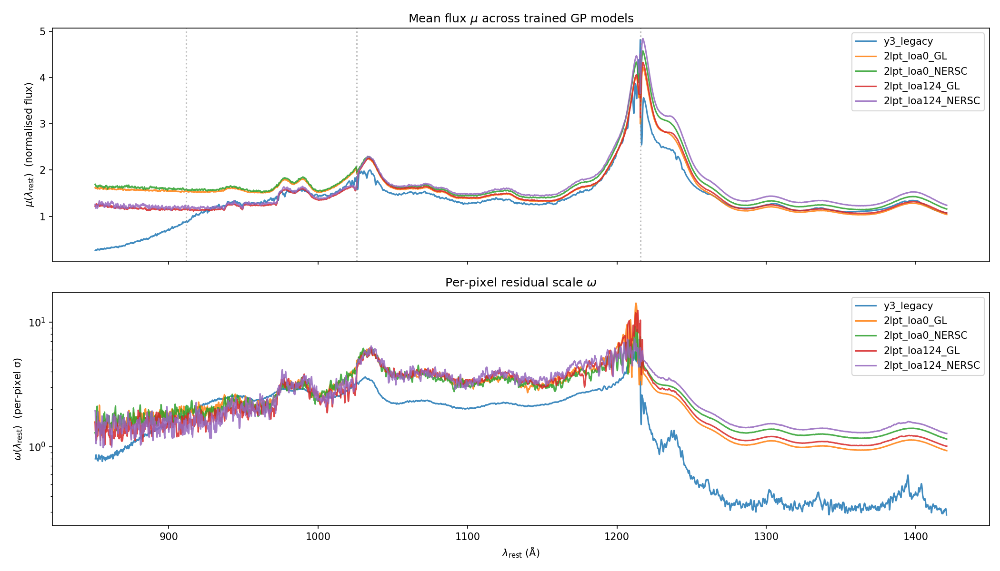
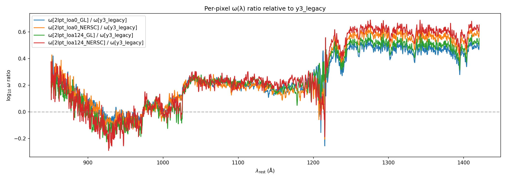
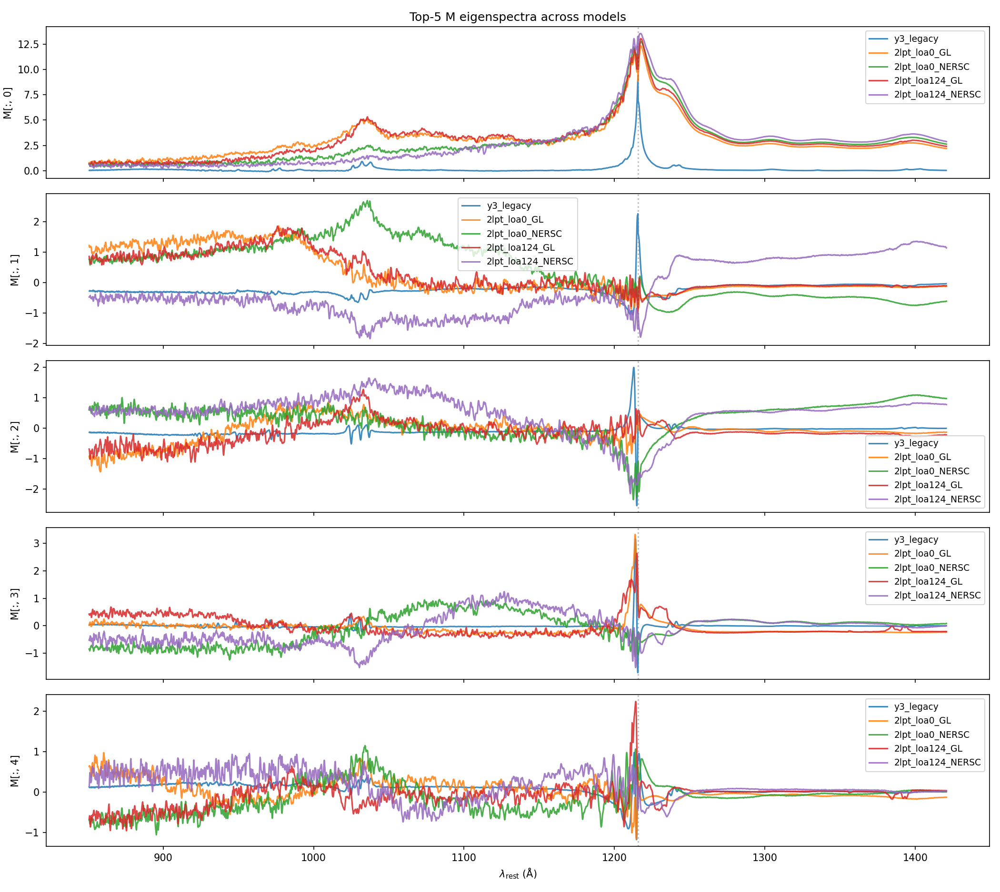
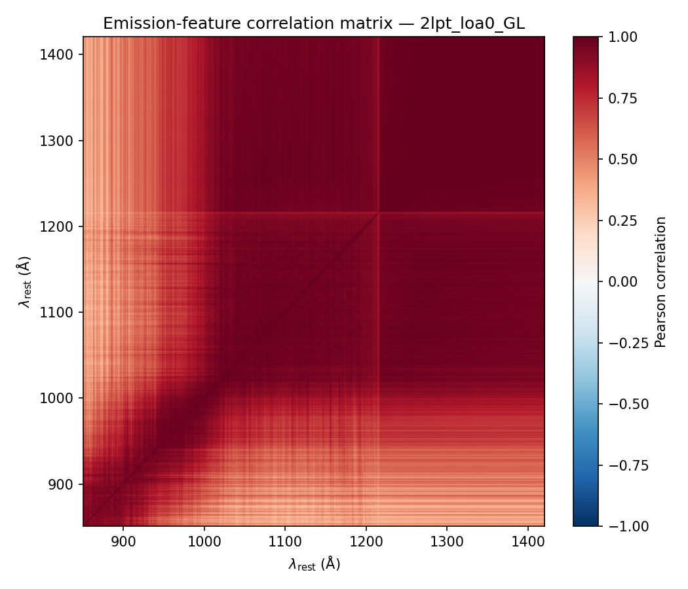
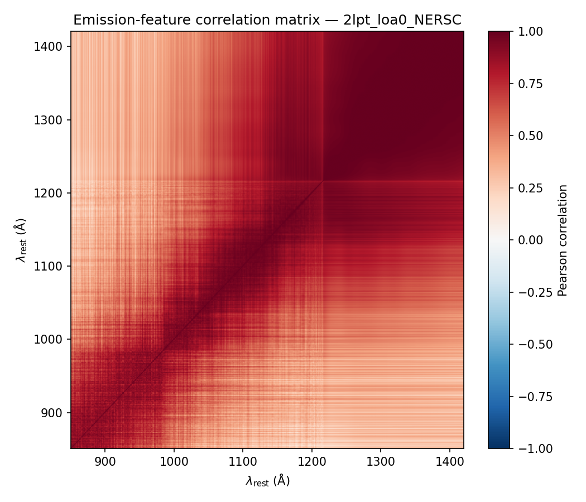
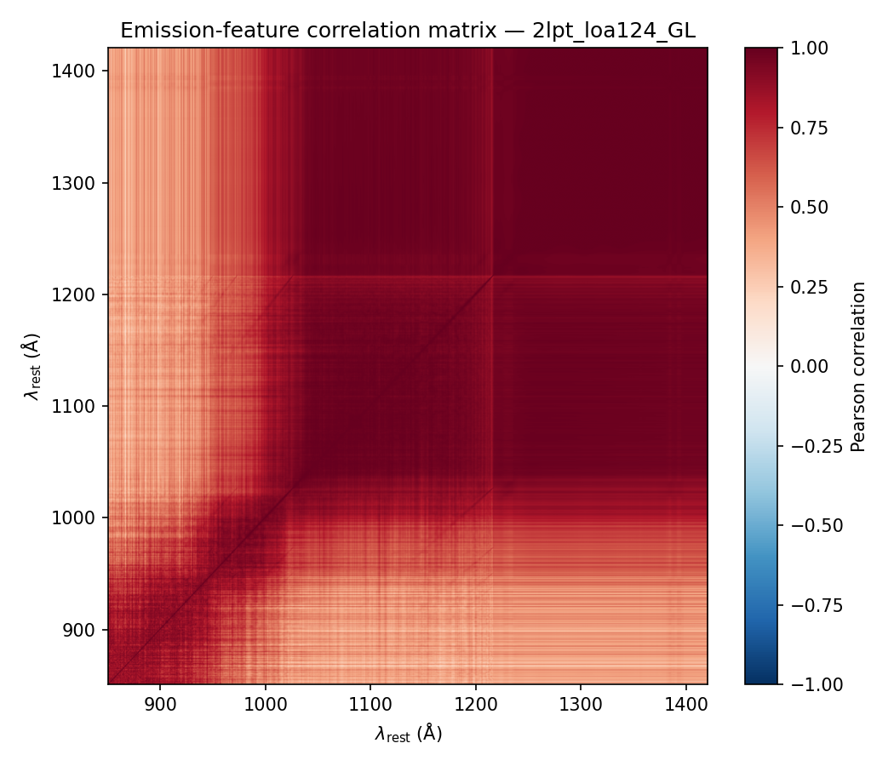
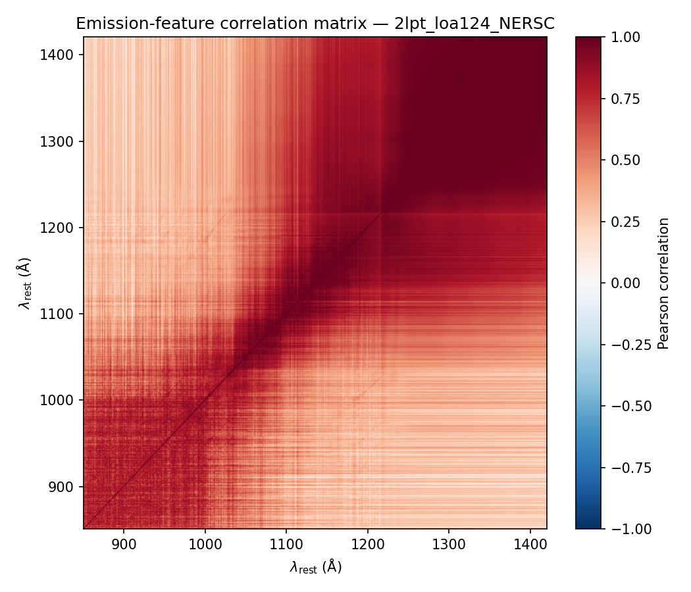

# 5-way GP model visualization: NERSC ↔ GreatLakes cluster reproducibility

Follow-up to [`docs/notes/2026-04-28_v2_3way_compare/report.md`](../2026-04-28_v2_3way_compare/report.md).
With the NERSC 2LPT runs (`52188320`, `52188321`) now finished, we have **two
independently-trained pairs**: the same data variant (loa-0 clean and
loa-124 with HCDs+BALs filtered out via truth catalogs) trained both on
GreatLakes (A40) and NERSC (A100). All four v2 runs use identical code,
identical random subset size (50,000 spectra), identical training schedule
(200 epochs, Adam lr=5e-3, cosine T_max=50, batch=12,500, k=30).

| tag | cluster | data | wall | source |
|---|---|---|---|---|
| `y3_legacy` | NERSC (legacy) | LOA real, "non-BAL non-DLA" pre-filtered | months | `learnlogs/model_epoch_920.h5` |
| `2lpt_loa0_GL` | GreatLakes A40 (spgpu) | 2LPT loa-0 clean | 15 m 6 s | job 48881057, epoch 199 |
| `2lpt_loa0_NERSC` | NERSC A100 (-q debug) | 2LPT loa-0 clean | ~16 min | job 52188320, epoch 199 |
| `2lpt_loa124_GL` | GreatLakes A100 MIG (gpu_mig40) | 2LPT loa-124, HCD/BAL filtered | 17 m 24 s | job 48914328, epoch 199 |
| `2lpt_loa124_NERSC` | NERSC A100 (-q debug) | 2LPT loa-124, HCD/BAL filtered | ~16 min | job 52188321, epoch 199 |

## Hyperparameter table

| tag | τ₀ | β | c₀ |
|---|---:|---:|---:|
| `y3_legacy` | 0.00210 | **2.41** | 0.174 |
| `2lpt_loa0_GL` | 0.00218 | 3.423 | 0.041 |
| `2lpt_loa0_NERSC` | 0.00200 | **3.530** | 0.040 |
| `2lpt_loa124_GL` | 0.00225 | 3.394 | 0.042 |
| `2lpt_loa124_NERSC` | 0.00204 | 3.376 | 0.041 |

The 3-way headline finding stands: **legacy Y3 has β = 2.41 (30σ below the
Y1 prior μ = 3.62), all four v2 models cluster around β = 3.4** (within
~6σ of the prior). This is consistent with the legacy `dlog_beta`
approximation (PR #4 finding) being the dominant cause; the 30σ gap can't
be explained by data physics alone.

## Cross-cluster reproducibility

The **same code, same data variant, different cluster** comparison is
the key new signal:

| pair | Δ τ₀ | Δ β | Δ c₀ |
|---|---:|---:|---:|
| loa-0:  GL vs NERSC | 9 % | 0.11 | 0.001 |
| loa-124: GL vs NERSC | 10 % | 0.018 | 0.001 |

Differences within the 4 v2 models are **dominated by the random subset of
50k spectra drawn from the ~921k post-z-filter pool**, not by the cluster.
β values differ by at most 0.15 across all 4 v2 runs; c₀ values agree to
within 0.001. **The v2 trainer reproduces across clusters** — important
because it means future production runs (NERSC for new training, GreatLakes
for diagnostics, etc.) won't drift in any systematic way.

### μ and ω overlay (5 models)



The four v2 curves (orange/green/red/purple) are visually indistinguishable
across the entire rest range, both for μ and ω. They sit ~2–3× above legacy
in ω(λ) at λ_rest > 1216 Å (side band) and 2–3× below in the forest core
(λ ≈ 950 Å) — same picture as the 3-way report.

### ω(λ) ratio relative to legacy Y3



All four v2 curves track each other closely. The two cluster-pair shifts
(GL→NERSC) are smaller than the variant shift (loa-0 → loa-124), and both
are much smaller than the legacy→v2 shift. **The trained ω(λ) is a robust
signature of the training-data distribution, not a cluster artefact.**

### Top-5 PCA eigenspectra



In eigenvector 0 (Lyα emission peak): GL and NERSC versions of the same
variant overlay almost perfectly. Eigenvectors 1–4 show some
between-cluster scatter from the different random samples but no
systematic pattern.

### Correlation matrices

The four v2 correlation matrices look essentially identical (more uniform
red than legacy's emission-line block structure):

| | |
|---|---|
|  |  |
|  |  |

## What didn't work yet

The two LOA debug submissions on NERSC (`52188322`, `52188323`) **timed
out during preload**:

- Both used `MAX_SPECTRA=300000` (the default at the time) → would have
  needed ~9 hours of preload alone (LOA `coadd-main-dark-*.fits` files
  contain ~1–3 spectra each, and 300k spectra fan out across 16,380 hpx
  files at ~9 spec/s on cfs).
- Got through ~2,568 of 16,380 hpx files in ~30 min before SLURM killed
  the job.
- Empty `loa_no_dla_no_bal_dbg_52188322/` and `loa_no_hcd_with_bal_dbg_52188323/`
  folders.

The fix is in commit `091a243` (lowered the LOA debug default to
`MAX_SPECTRA=50000`). Resubmit on NERSC with the fix:

```bash
ssh perlmutter
cd ~/desi_gpy_dla_detection
git fetch && git pull              # important — pulls the MAX_SPECTRA fix
sbatch --export=ALL,VARIANT=no_dla_no_bal     slurm_train/submit_e2e_train_loa_nersc_debug.sh
sbatch --export=ALL,VARIANT=no_hcd_with_bal   slurm_train/submit_e2e_train_loa_nersc_debug.sh
sbatch --export=ALL,VARIANT=no_hcd_no_bal     slurm_train/submit_e2e_train_loa_nersc_debug.sh
```

## Conclusions

1. **Cross-cluster reproducibility verified**: the v2 trainer produces
   indistinguishable models on GreatLakes A40 (or A100 MIG) vs NERSC A100
   given the same data and config. Differences are dominated by the
   random 50k subset.

2. **Legacy `dlog_beta` bug verified by elimination**: four independent
   v2 models all converge to β ≈ 3.4, while legacy Y3 sits at β = 2.41.
   The data physics of LOA real vs 2LPT mock cannot account for a 30σ
   prior departure — the gradient direction is the most likely cause.
   Task #20 (legacy retrained on the same data via v2 trainer) is the
   final attribution test.

3. **Truth-catalog filter is variant-distinguishing but cluster-stable**:
   loa-0 (clean by construction) and loa-124 (filtered) produce nearly
   identical models, but both differ from legacy. The 30k-row HCD-anti-
   join captured what mattered without introducing new cluster-level
   variance.

4. **NERSC-LOA pipeline is gated on the MAX_SPECTRA fix landing on the
   user's NERSC checkout**: the 30-min `-q debug` queue can't preload
   300k LOA spectra. After `git pull` on NERSC, the 50k default fits in
   ~10 min preload + ~5 min train, comfortably under the queue cap.

## Reproduce

```bash
python examples/diagnose_trained_gp.py visualize \
    --model y3_legacy:/.../learnlogs/model_epoch_920.h5 \
    --model 2lpt_loa0_GL:/.../learnlogs_v2/2lpt_loa0_48881057/model_epoch_0199.h5 \
    --model 2lpt_loa0_NERSC:/.../v2_runs/2lpt_loa0_52188320/model_epoch_0199.h5 \
    --model 2lpt_loa124_GL:/.../learnlogs_v2/2lpt_loa124_nohcd_nobal_48914328/model_epoch_0199.h5 \
    --model 2lpt_loa124_NERSC:/.../v2_runs/2lpt_loa124_nohcd_nobal_52188321/model_epoch_0199.h5 \
    --out-dir docs/notes/2026-04-28_v2_5way_compare \
    --n-eigenspectra 5
```

Hyperparameter dump: [`hyperparameters.json`](./hyperparameters.json).
