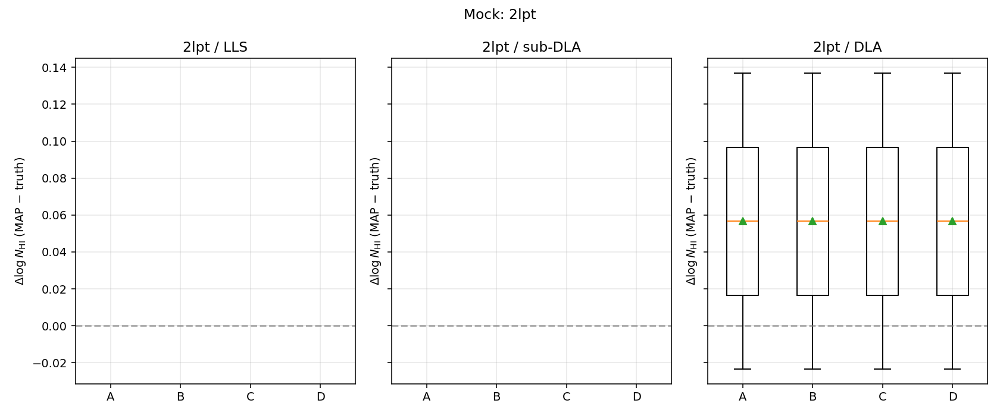
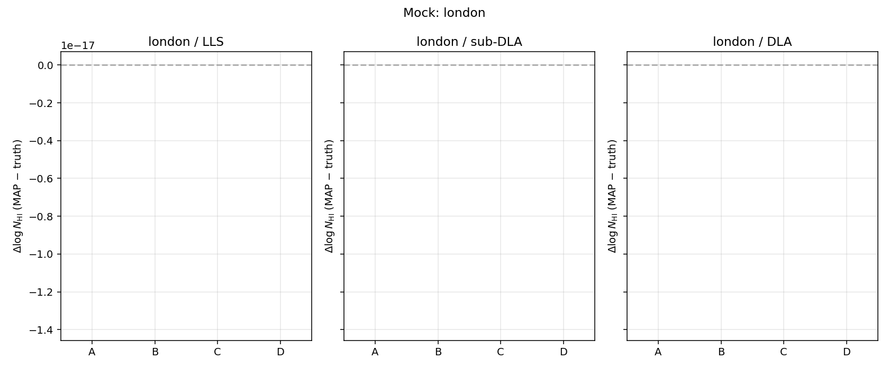
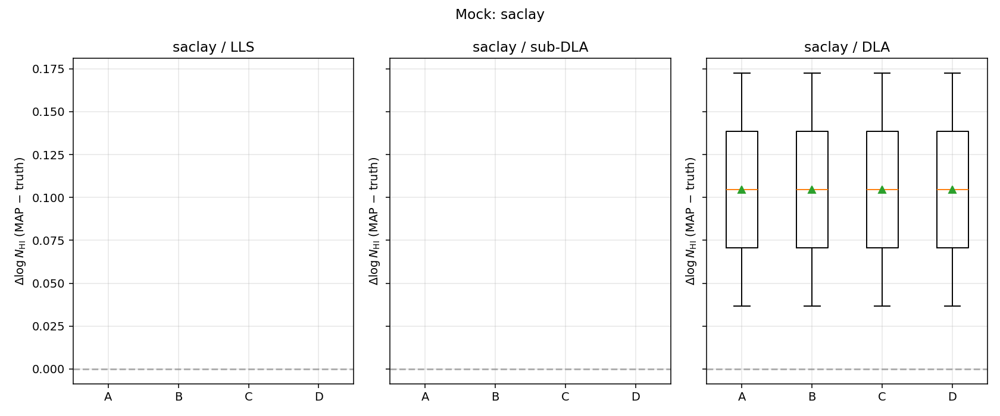
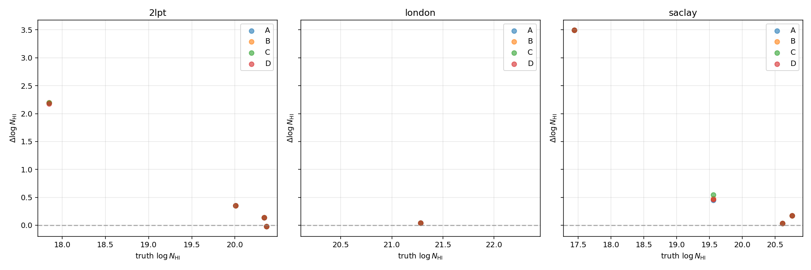

# Voigt LSF + num_lines sweep — analysis

Source: `/nfs/turbo/lsa-cavestru/mfho/DESI/pscratch/desi_gpy_dla_detection/voigt_sweep_48947439/runs/master.csv` (72 inferences)

## Configurations

| tag | kernel | num_lines |
|---|---|---:|
| **A** | `boss-log-r2000` | 3 |
| **B** | `desi-linear-r3000` | 3 |
| **C** | `desi-linear-r3000` | 6 |
| **D** | `none` | 3 |

## Median ΔlogNHI = MAP − truth, per (mock × regime × config)

### Mock: `2lpt`

| regime | A: ΔlogNHI [p16, p84] | B: ΔlogNHI [p16, p84] | C: ΔlogNHI [p16, p84] | D: ΔlogNHI [p16, p84] |
|---|---|---|---|---|
| LLS | +2.197 [+2.197, +2.197] (n=1) | +2.197 [+2.197, +2.197] (n=1) | +2.193 [+2.193, +2.193] (n=1) | +2.176 [+2.176, +2.176] (n=1) |
| sub-DLA | +0.349 [+0.349, +0.349] (n=1) | +0.349 [+0.349, +0.349] (n=1) | +0.349 [+0.349, +0.349] (n=1) | +0.349 [+0.349, +0.349] (n=1) |
| DLA | +0.057 [+0.002, +0.111] (n=2) | +0.057 [+0.002, +0.111] (n=2) | +0.057 [+0.002, +0.111] (n=2) | +0.057 [+0.002, +0.111] (n=2) |

### Mock: `london`

| regime | A: ΔlogNHI [p16, p84] | B: ΔlogNHI [p16, p84] | C: ΔlogNHI [p16, p84] | D: ΔlogNHI [p16, p84] |
|---|---|---|---|---|
| LLS | +nan [+nan, +nan] (n=0) | +nan [+nan, +nan] (n=0) | +nan [+nan, +nan] (n=0) | +nan [+nan, +nan] (n=0) |
| sub-DLA | +nan [+nan, +nan] (n=0) | +nan [+nan, +nan] (n=0) | +nan [+nan, +nan] (n=0) | +nan [+nan, +nan] (n=0) |
| DLA | +0.039 [+0.039, +0.039] (n=1) | +0.039 [+0.039, +0.039] (n=1) | +0.039 [+0.039, +0.039] (n=1) | +0.039 [+0.039, +0.039] (n=1) |

### Mock: `saclay`

| regime | A: ΔlogNHI [p16, p84] | B: ΔlogNHI [p16, p84] | C: ΔlogNHI [p16, p84] | D: ΔlogNHI [p16, p84] |
|---|---|---|---|---|
| LLS | +3.498 [+3.498, +3.498] (n=1) | +3.498 [+3.498, +3.498] (n=1) | +3.498 [+3.498, +3.498] (n=1) | +3.498 [+3.498, +3.498] (n=1) |
| sub-DLA | +0.449 [+0.449, +0.449] (n=1) | +0.477 [+0.477, +0.477] (n=1) | +0.543 [+0.543, +0.543] (n=1) | +0.463 [+0.463, +0.463] (n=1) |
| DLA | +0.104 [+0.058, +0.151] (n=2) | +0.104 [+0.058, +0.151] (n=2) | +0.104 [+0.058, +0.151] (n=2) | +0.104 [+0.058, +0.151] (n=2) |

## Reading these results

- **Config A** is production. Its bias is the baseline. Y3 mocks have shown +0.37 dex on the canonical regression target (TID 120046865).
- **Config B** isolates the LSF effect. If B's bias < A's, the BOSS-shaped kernel on a DESI grid is contributing.
- **Config C** adds higher-order Lyman lines on top of the DESI kernel. If C's bias < B's, the production num_lines=3 is also contributing.
- **Config D** is bare Voigt (no LSF). If D's bias matches B's, the LSF wasn't the dominant effect; mock-physics or QMC are.

## Per-mock comparison
- Differences across mocks reveal **mock-physics** effects, not inference effects. London is known to use approximate Lyman series scaling (rescale by oscillator strength rather than per-line Voigt) — if config A on London disagrees with config A on 2LPT/Saclay, that could be a mock generator artefact rather than the GP's fault.

## Per-NHI-regime comparison
- **DLA regime (logNHI ≥ 20.3)**: damping-wing-dominated. LSF matters most here — if the model trough is too narrow, the fitter compensates with high NHI.
- **sub-DLA / LLS regimes**: Doppler-core-dominated. LSF effect is smaller; bias here is more likely from prior-edge or QMC-density effects.