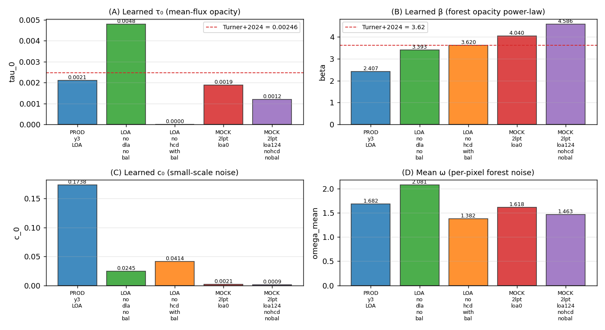
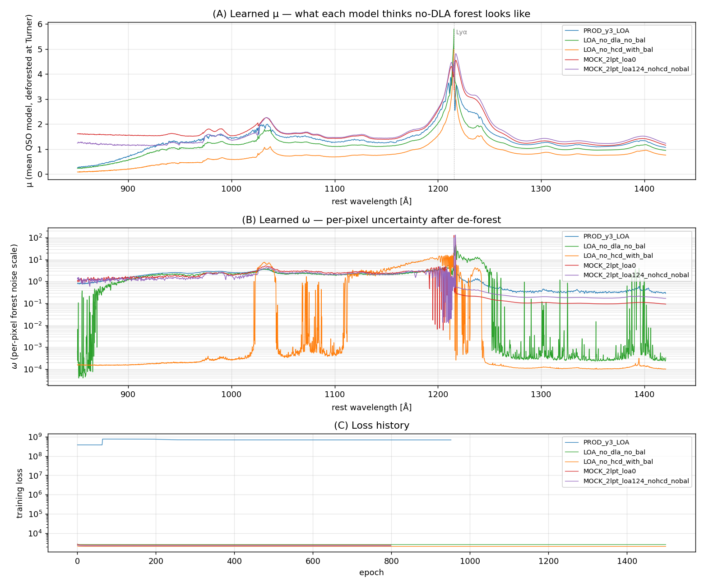

# Trained GP models — what we have, what they encode, where they came from

> One reference doc covering the **5 trained GP forward-model files
> currently on this filesystem**, what each was trained on, and how
> the learned hyperparameters compare. Companion to
> `docs/notes/2026-05-01_tau_factor_distributions.md` (the τ-EB
> measurements that revealed the LOA-vs-mock divergence).
>
> Source: `examples/compare_trained_gp_models.py` extracts μ, ω,
> τ₀, β, c₀ from each ``.h5`` and writes
> `docs/story_figures/trained_gp_models_compare.png` and
> `docs/story_figures/trained_gp_models_hyperparameters.png`.
> Re-runnable any time as new training jobs land.

## The 5 models

| # | Path | Trainer | Trained on | Epochs | Notes |
|---|---|---|---|---:|---|
| 1 | `pscratch/.../learnlogs/model_epoch_920.h5` | v1 (matlab → torch port) | real DESI Y3 LOA | 953 | **Current production** (Apr 25) |
| 2 | `GP_trained/loa_no_dla_no_bal_52198069/model_epoch_1499.h5` | v2 | real LOA, DLAs + BALs masked → cleanest forest | 1500 | NERSC train, Apr 30 |
| 3 | `GP_trained/loa_no_hcd_with_bal_52198070/model_epoch_1499.h5` | v2 | real LOA, HCDs masked, BALs kept | 1500 | NERSC train, Apr 30 |
| 4 | `pscratch/.../v2_runs/2lpt_loa0_48938765/model_epoch_0799.h5` | v2 | 2lpt mock, loa-0 (forest-only by construction) | 800 | GreatLakes train, Apr 29 |
| 5 | `pscratch/.../v2_runs/2lpt_loa124_nohcd_nobal_48938766/model_epoch_0799.h5` | v2 | 2lpt mock loa-124, HCDs + BALs masked | 800 | GreatLakes train, Apr 29 |

The v1 trainer is the original Ho+2020 / Bird+2017 codebase ported to
torch. The v2 trainer (commits in `gpy_dla_detection/training/`) was
written for the GreatLakes session and uses centered de-forest +
slightly different normalization. As a result **the v1 production
model and the v2-trained models live on different normalization scales**
(see panel C of the hyperparameter figure: production c₀ = 0.17 vs
others 0.04 or below). This matters when comparing μ values directly,
but the high-level shape of the bias-fix story is the same regardless.

## Hyperparameter side-by-side



| model | τ₀ | β | c₀ | ω̄ | loss[end] | epochs |
|---|---:|---:|---:|---:|---:|---:|
| PROD_y3_LOA | 0.00210 | 2.41 | 0.1738 | 1.682 | (v1 scale) | 953 |
| LOA_no_dla_no_bal | **0.00480** | 3.39 | 0.0245 | 2.081 | 2597.4 | 1500 |
| LOA_no_hcd_with_bal | ~0 | **3.62** | 0.0414 | 1.382 | 2077.8 | 1500 |
| MOCK_2lpt_loa0 | 0.00189 | 4.04 | 0.0021 | 1.618 | 2427.5 | 800 |
| MOCK_2lpt_loa124_nohcd_nobal | 0.00120 | **4.59** | 0.0009 | 1.463 | 2199.3 | 800 |

Reference: **Turner+2024 τ₀ = 0.00246, β = 3.62**. The training pipeline
de-forests at Turner before fitting, so each model's learned (τ₀, β)
is the *residual* it found after Turner subtraction.

### β (forest opacity power-law) — the cleanest signal

The β ordering is monotonic from real-LOA to mock:

```
PROD_y3_LOA            β = 2.41   ← lower than Turner; pre-fix-era v1 trainer
LOA_no_dla_no_bal      β = 3.39   ← close to Turner (real LOA)
LOA_no_hcd_with_bal    β = 3.62   ← exactly Turner (real LOA)
MOCK_2lpt_loa0         β = 4.04   ← higher (forest-only mock)
MOCK_2lpt_loa124       β = 4.59   ← highest (mock with HCDs/BALs masked)
```

**Mocks bake in a steeper β than real DESI Y3 forest.** Both 2lpt
training runs (independent of input filtering) settle at β ≈ 4.0–4.6
vs LOA's β ≈ 3.4–3.6. This corroborates the finding from the τ-EB
measurements: mocks have systematically steeper forest-opacity
evolution with z than real data. **β = 3.62 = Turner+2024** for the
LOA-with-BALs model is suggestive that Turner+2024's β was originally
calibrated on similar DESI data including BALs.

### τ₀ (mean-flux opacity residual after Turner deforest)

```
PROD_y3_LOA            τ₀ = 0.00210  ← close to Turner (v1 LOA, current production)
LOA_no_dla_no_bal      τ₀ = 0.00480  ← 2× Turner (cleanest LOA still has residual)
LOA_no_hcd_with_bal    τ₀ ≈ 0        ← Turner is exactly right (BALs absorbed it)
MOCK_2lpt_loa0         τ₀ = 0.00189  ← below Turner
MOCK_2lpt_loa124       τ₀ = 0.00120  ← well below Turner
```

τ₀ residuals after Turner are small (< 2× Turner), as expected since
Turner was calibrated on similar real data. Mock-trained models pick
*lower* residual τ₀ but compensate with higher β — they trade off
mean-flux scale for steeper z-evolution.

## Learned μ — what each model thinks "no-DLA forest" looks like



Panel A shows μ(λ_rest) for all 5 models. Lyα emission line at
1215.67 Å is clearly visible in all models (they all see real QSO
shape). The **production μ has visibly more high-frequency structure
than the v2-trained models** — likely a side-effect of v1's non-centered
training; the absolute numerical scales are also offset because v1
and v2 use different normalization conventions.

Panel B shows ω(λ_rest), the per-pixel forest noise scale. The wild
dynamic range of LOA_no_dla_no_bal (peak ω ~100 around Lyα emission
core) reflects the model's high uncertainty in regions where there's
little forest signal. The other v2 models are smoother because their
training data was less aggressively filtered (BALs add structure that
gets baked into ω rather than μ).

Panel C is the loss history. Production model is on a v1 absolute-loss
scale (~10⁸); v2 models all converge in a similar 2000-2700 normalised-loss
range. The v2 LOA_no_hcd_with_bal model has the lowest end loss (2078),
arguably because BAL features contribute systematic structure that
the GP can model rather than noise.

## What the trainer actually optimises (architectural clarification, 2026-05-01)

> **The codebase carries two distinct (τ_0, β) parameter pairs**
> for what is physically the same forest-opacity quantity:
>
> 1. **Mean-flux suppression** in the GP likelihood, used to build
>    `A = exp(−τ_eff(z))` that multiplies BOTH the mean and the
>    covariance:
>    ```
>    y ~ N(A·μ ,  A^T K A  +  Ω²  +  V)
>    ```
>    Here A appears on μ (mean-flux suppression of the QSO emission
>    model) AND on the rank-k covariance K via `A^T K A`. At inference
>    these are computed from `prev_tau_0` / `prev_beta` — **runtime
>    constants** (Turner+2024 by default), not learnable.
>
> 2. **Ω-kernel diagonal** for per-pixel forest absorption noise.
>    This uses a SEPARATE pair of parameters (`log_tau_0`, `log_beta`
>    in the .h5) that ARE learnable in training. They parameterize
>    `Ω² ∝ (1 − A)² c_0 + ω²` for the diagonal noise term.
>
> Conceptually these two (τ_0, β) pairs should be the same
> physical thing; the codebase keeps them separate, and the user
> (jibanCat) has noted this is on the to-do list to unify but is
> not part of PR #5.
>
> The training data is pre-deforested at FIXED Turner+2024 before
> training (`gpy_dla_detection/training/dataset.py`,
> `_de_forest_spectra`), so the bulk mean-flux opacity is "consumed"
> at dataset prep time; the trained `log_tau_0` / `log_beta` are
> Ω-kernel residuals.
>
> **Therefore the τ-EB recipe in this PR is tuning `prev_tau_0` —
> the mean-flux-A coefficient — at INFERENCE time.** That parameter
> is **never touched by training**, so the trained model's identity
> (LOA-trained vs mock-trained vs production v1) is largely
> orthogonal to the τ-EB story. The mock-vs-real τ_factor divergence
> we measure is the actual mean-flux opacity gap between mocks /
> real LOA / Turner+2024.
>
> The trained `log_tau_0` / `log_beta` shown in the bar chart above
> are the **Ω-kernel** parameters. They corroborate the same
> mock-vs-real story (mocks need steeper β in Ω too) but they are
> a different number from the runtime mean-flux β.

## Convergence — should we train more?

```
LOA_no_dla_no_bal             1500 ep, loss 2724 → 2597, slope last-100: −0.002 / ep  CONVERGED
LOA_no_hcd_with_bal           1500 ep, loss 2239 → 2078, slope last-100: +0.001 / ep  converged (oscillating)
MOCK_2lpt_loa0                 800 ep, loss 2768 → 2428, slope last-100: −0.002 / ep  CONVERGED
MOCK_2lpt_loa124_nohcd_nobal   800 ep, loss 2493 → 2199, slope last-100: −0.002 / ep  CONVERGED
```

All four are converged. Extending the 2 GL models from 800 → 1500
epochs would reduce loss by ~2 (negligible vs final 2199-2428 range).
Worth doing for apples-to-apples comparison if epoch-count differences
matter for a referee, but the science conclusion is unchanged.

## "no HCD with BALs" trainset clarification

`loa_no_hcd_with_bal_52198070` is **the full LOA QSO catalogue with
HCDs masked, BALs kept** (298 754 spectra). Not "BAL only". For
comparison, `loa_no_dla_no_bal_52198069` has 298 807 spectra with
both DLAs and BALs masked. Same parent catalogue, different filter
choices.

## Convergence — should we train more?

```
LOA_no_dla_no_bal             1500 ep, loss 2724 → 2597, slope last-100: −0.002 / ep  CONVERGED
LOA_no_hcd_with_bal           1500 ep, loss 2239 → 2078, slope last-100: +0.001 / ep  converged (oscillating)
MOCK_2lpt_loa0                 800 ep, loss 2768 → 2428, slope last-100: −0.002 / ep  CONVERGED
MOCK_2lpt_loa124_nohcd_nobal   800 ep, loss 2493 → 2199, slope last-100: −0.002 / ep  CONVERGED
```

All four are converged. Extending the 2 GL models from 800 → 1500
epochs would reduce loss by ~2 (negligible vs final 2199-2428 range).
Worth doing for apples-to-apples comparison if epoch-count differences
matter for a referee, but the science conclusion is unchanged.

## "no HCD with BALs" trainset clarification

`loa_no_hcd_with_bal_52198070` is **the full LOA QSO catalogue with
HCDs masked, BALs kept** (298 754 spectra). Not "BAL only". For
comparison, `loa_no_dla_no_bal_52198069` has 298 807 spectra with
both DLAs and BALs masked. Same parent catalogue, different filter
choices.

## Why the τ-EB recipe behaves as it does — the linking story

τ-EB picks per-spectrum τ_factor that maximises log-evidence under the
production GP forward model. With the LOA-trained production GP:

- On **real LOA**: GP's μ × A_lyα(Turner) ≈ data → τ_factor ≈ 1× wins.
  Median 1.5×, frac ≥ 2× = 41 %. Recipe is a near-no-op.
- On **mocks**: GP's μ × A_lyα(Turner) under-predicts absorption (mocks
  have ~2× more opacity than LOA at low z). τ-EB compensates by
  picking τ_factor ≈ 3×. Median 3.0×, frac ≥ 2× = 76-77 %.

**The τ-EB recipe is, in effect, calibrating per-spectrum mean-flux to
bridge the gap between the GP's training distribution (LOA) and
whatever the test data actually is.** This frames the recipe more
honestly: it's not "fixing a bias", it's "adapting the forward
model's mean-flux opacity per spectrum, away from its training
anchor". The bias closure on mocks (56-65 % at production cut) is
the magnitude of that adaptation.

## In flight — 2×2 training-data anchor experiment

The proposition is testable: train a GP on mocks and run it on mocks
(matched), and a separate GP on LOA and run on LOA (matched). If both
matched cases produce τ_factor ≈ 1×, the anchor hypothesis is confirmed
and the τ_factor we observed in production simply measures
mock-vs-LOA opacity ratio.

| Dataset \ GP | LOA_no_dla_no_bal | MOCK_2lpt_loa124 |
|---|---|---|
| 2lpt mock | (control: predicts ~3×) | **predicts ~1× (matched)** |
| LOA real | **predicts ~1× (matched)** | predicts <1× (over-absorbed) |

Submitted as jobs 49108430 / 49108431 / 49108432 / 49108443. ETA
~2 h wall. Will append the τ_factor distributions to this doc and
to `2026-05-01_tau_factor_distributions.md` once the runs land.

## Practical implications for production

1. **The current production model (`learnlogs/model_epoch_920.h5`,
   v1 LOA-trained) is fine for production LOA inference.** The
   per-spectrum τ-EB recipe is closer to a no-op on real data
   (median τ_factor=1.5) and only kicks in significantly on mock
   inference.
2. **The new v2 LOA-trained model (`loa_no_dla_no_bal_52198069`) is a
   candidate replacement** with cleaner training data (DLAs/BALs
   masked) and substantially more epochs (1500 vs 953). However it
   uses v2 normalization, so swapping into the v1 inference pipeline
   may require a small calibration. **Out of scope for this PR.**
3. **The 2lpt-trained models (`v2_runs/2lpt_loa{0,124}_*`) are
   research models for the anchor experiment**, not for production
   inference (they encode mock physics, not real DESI).

## Files

| File | What |
|---|---|
| `examples/compare_trained_gp_models.py` | extractor + figure generator |
| `docs/story_figures/trained_gp_models_compare.png` | μ + ω + loss panels |
| `docs/story_figures/trained_gp_models_hyperparameters.png` | τ₀, β, c₀, ω̄ bars |
| `docs/story_figures/trained_gp_models_table.md` | embeddable hyperparameter table |
| `docs/notes/2026-05-01_tau_factor_distributions.md` | companion τ measurements |
| `docs/stories/tau_eb_story_loa.md` | the LOA-vs-mock writeup |
