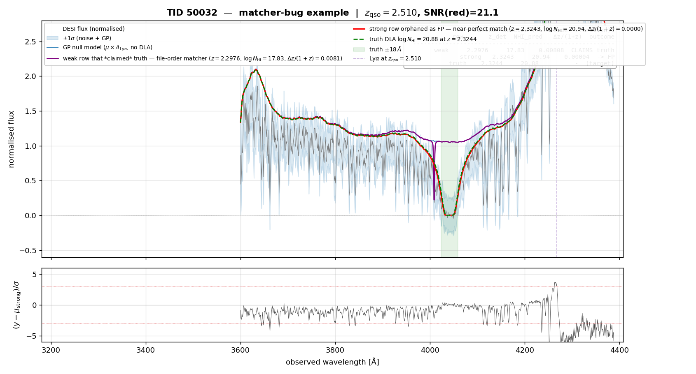
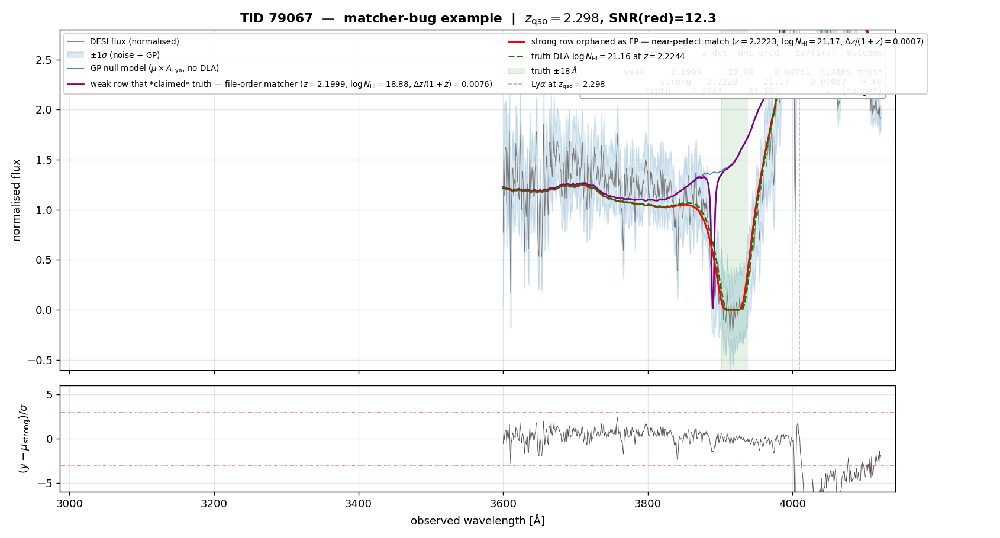
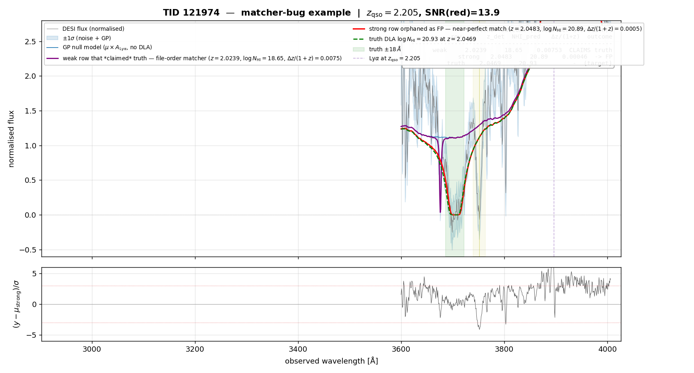
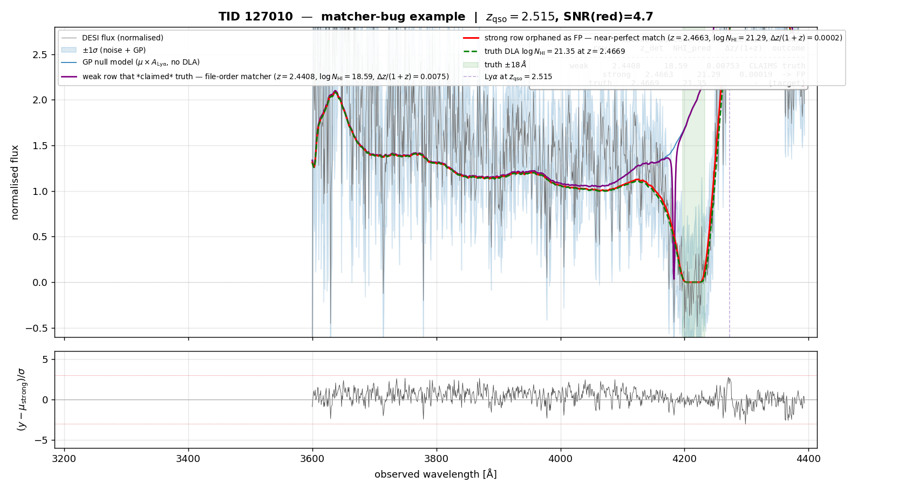
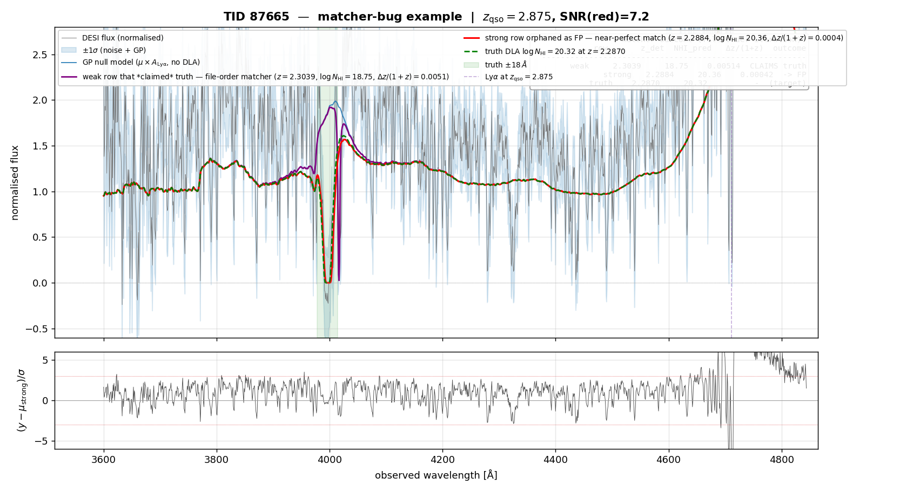

# Order-dependence in the DLA truth-matcher — a note to share

> **Audience:** Molly Wolfson and anyone using the same DLA → truth matcher
> for DESI Y3 mock evaluation.
> **Author:** Ming-Feng Ho (jibancat), 2026-05-19.
> **Reference:** verified against
> `/pscratch/sd/j/jibancat/molly/read_in_each_up_match_new_cats_2509.ipynb`
> (function `match_detections_to_dla_cat`, defined in the 9th code cell).

## Headline finding

The greedy 1-to-1 matcher we are both using has a real **order-dependence
bug** on multi-absorber spectra (MAX_DLAS ≥ 2): when the GP catalog emits
more than one detection per spectrum and a **weak/decoy detection appears
earlier in the catalog file** than the strong correct detection on the
same line of sight, the weak row reaches the shared truth DLA first,
claims it, and the strong correct detection is then orphaned as a false
positive while the truth DLA quietly disappears from the false-negative
list as well.

The downstream effect on the V1 GP-DLA 5k London-0 run (`MAX_DLAS=3`,
2-way single-absorber):

- **14 of 68 false-positive rows (20.6 %)** are actually correct strong-DLA
  detections (own NHI_pred 20.4–22.0, sitting on a truth DLA with
  NHI 20.3–21.9 within Δz/(1+z) ≤ 0.011).
- **13 of those 14 truth DLAs are missing from the false-negative list**
  on the same TID, so the same DLA is double-dropped — neither TP nor FP
  in any meaningful sense, and not counted as FN either.
- Headline purity is therefore understated by ~4 pp: reported **0.804** for
  the V1 5k run, corrected floor ≥ **0.844** (and the corrected
  completeness moves up too, since 13 truth DLAs would return as TP).

I want to share this in detail because (a) both our pipelines run the
same matcher, (b) the bias is one-signed (always *pessimistic*, never
optimistic) so it's been quietly suppressing the true catalog performance
across recent comparisons, and (c) it is a one-line fix.

## The exact code

Copied verbatim from
`/pscratch/sd/j/jibancat/molly/read_in_each_up_match_new_cats_2509.ipynb`
(my line numbers are from `jq`-flattened code, not the .ipynb cell layout
— grep on `def match_detections_to_dla_cat`):

```python
def match_detections_to_dla_cat(detcat, dlacat=dla_cat_init,
                                qsos_z_cat=z_cat_init, dla_name='ZDLA',
                                snrcat=snr_cat, snr_key='SNR_REDSIDE'):
    matched = np.zeros(len(dlacat), dtype=bool)       # truth-claim flag
    ztrue, nhitrue, zqso, snr_r, snr_b = [], [], [], [], []

    for entry in tqdm(range(len(detcat))):            # *** detections in input order ***
        tid = detcat['TARGETID'][entry]
        if np.any(dlacat['TARGETID'] == tid):
            idx = np.argwhere(tid == dlacat['TARGETID'])
            idx = idx.reshape(len(idx),)
            tidmatch = dlacat[idx]
            zdiff = abs(detcat[dla_name][entry] - tidmatch['Z_DLA']) \
                    / (1 + tidmatch['Z_DLA'])
            if np.any(zdiff < 0.01):
                n = np.argwhere(zdiff < 0.01); n = n.reshape(len(n),)
                if (len(n) == 1) & np.any(matched[idx[n]] != True):
                    ztrue.append(tidmatch[n]['Z_DLA'][0])
                    nhitrue.append(tidmatch[n]['NHI'][0])
                    matched[idx[n]] = True                              # claim
                elif (len(n) > 1) & np.any(matched[idx[n]] != True):
                    nhidiff = np.argsort(abs(detcat['NHI'][entry]
                                              - tidmatch['NHI'][n].data))
                    j = nhidiff[matched[idx[n]] != True][0]
                    ztrue.append(tidmatch[n[j]]['Z_DLA'])
                    nhitrue.append(tidmatch[n[j]]['NHI'])
                    matched[idx[n[j]]] = True                           # claim
                else:
                    ztrue.append(np.nan); nhitrue.append(np.nan)        # taken
            else:
                ztrue.append(np.nan); nhitrue.append(np.nan)            # no match
        else:
            ztrue.append(np.nan); nhitrue.append(np.nan)                # no TID
        # …zqso / snr appending follows…
    return ztrue, nhitrue, zqso, snr_r
```

The order-dependence is in **one line**: the outer `for entry in range(len(detcat))`
walks the detection catalog in input order. Whatever order the GP emits
its multi-DLA rows in becomes the matching priority.

(My `examples/molly_faithful_pc_plots.py:301` — `match_truth_to_cat_molly`
— is a verbatim port of this same algorithm, so it has the same bug.)

### Where "one detection per truth" is actually enforced

It's reasonable to ask, reading the body of the loop, where the matcher
prevents a single truth absorber from being claimed by multiple
detections. The enforcement is split across three places:

- **`matched = np.zeros(len(dlacat), dtype=bool)`** — a flag indexed by
  *truth-table* position. One bool per truth absorber.
- The two **gating conditions** `np.any(matched[idx[n]] != True)` (the
  `if` and `elif` branches) — both fire only when at least one of the
  close-enough truth candidates is still unclaimed.
- The **claim writes** `matched[idx[n]] = True` and
  `matched[idx[n[j]]] = True` — the only two places `matched` is set,
  and inside the multi-candidate branch `j = nhidiff[matched[idx[n]] != True][0]`
  also restricts the pick to unmatched-only.

If every close-enough truth has already been claimed, both `if` and
`elif` evaluate False and the loop falls through to the trailing `else:
ztrue.append(np.nan)` — the current detection gets no truth assignment
and ends up as an FP downstream. So a single truth absorber **can be
flipped to `matched=True` exactly once**; whichever detection trips the
claim first wins, and the *order* of that "first" is what's broken.

Worked trace, TID 50032 (1 truth DLA at z=2.3244, NHI=20.88; 2 catalog
detections, the weak row written first):

| step | detection processed | candidates `n` (close-in-z truth indices) | `matched[idx[n]]` before | branch | outcome |
|------|---------------------|-------------------------------------------|--------------------------|--------|---------|
| 1 | row #1 (weak, z=2.2976, NHI=17.83) | `[truth_at_2.3244]` (Δz/(1+z)=0.008) | `[False]` | single-cand `if` | **claims truth**, sets `matched=True` |
| 2 | row #2 (strong, z=2.3243, NHI=20.94) | `[truth_at_2.3244]` (Δz/(1+z)=6e-5) | `[True]` (just claimed) | trailing `else` | `ztrue = NaN` → **flagged FP** |

The weak row's claim survives — `matched[…]` is never unset — and the
strong row's near-perfect match is unrecoverable. This is exactly the
"one-signed pessimism" of reason 2 below.

## Three reasons this is the wrong thing to do

1. **The result depends on a meaningless ordering.** The "input order" of
   the GP catalog is whatever the inference pipeline happened to emit —
   per-spectrum, the GP forward-search records absorbers in z-search order
   (roughly z-ascending), which has nothing to do with which detection is
   the *correct match* to a given truth DLA. A matcher whose output depends
   on which order the multi-DLA rows were written into the FITS file is
   not a property of the data; it is a property of the pipeline's record-
   keeping. Re-shuffling the catalog rows should not change the P/C score,
   and right now it does.
2. **It is biased downwards on multi-DLA spectra.** A common GP outcome on
   a real strong DLA is *one* near-perfect (Δz/(1+z) ≈ 10⁻⁴) strong-NHI
   detection **plus** one or two extra weak-NHI rows nearby in z (the GP's
   multi-absorber search is allowed up to MAX_DLAS=3; weak decoys are
   common when the truth has only one strong absorber). The weak decoy is
   always *less* well-matched in z and NHI, yet under file-order iteration
   it gets to claim the truth first if it sits earlier in z-search order.
   So multi-DLA spectra systematically lose their strongest, best-matched
   detection — exactly the rows we most want to count as TP. The
   pessimism is one-signed: an FP that is in fact a *better* match than
   the row that claimed the truth is never counted as TP.
3. **The truth simultaneously disappears from the FN list.** Because the
   weak decoy did claim the truth (it set `matched[idx[n]] = True`), the
   downstream FN computation correctly says "the truth was matched, so it
   isn't an FN." But the weak decoy doesn't actually pass the headline
   detection cuts (NHI_pred < 20.3 → it never registers as a TP either).
   So a real strong DLA, with a real near-perfect detection, ends up
   counted as **neither TP, nor FP-that-is-actually-an-FP, nor FN** — it
   has fallen out of the ledger entirely. The 14 cases below all do this.

## Sample spectra — the failure pattern in raw rows

V1 GP-DLA 5k London-0 run; truth = `dla_cat.fits` for the same mock.
Δz/(1+z) computed against truth.

**TID 50032 — the cleanest example.** Truth: one DLA at z = 2.32440,
NHI = 20.88.

| catalog row | z_det | NHI_pred | Δz/(1+z) to truth | matcher outcome |
|------------:|------:|---------:|------------------:|----------------|
| #1 (weak)   | 2.29755 | **17.83** | 0.00805 (< 0.01) | **claims** the truth |
| #2 (strong) | 2.32430 | **20.94** | **0.00006** (≈ perfect) | truth taken → **FP** |

The strong row #2 is six orders of magnitude closer in z and a better
NHI match (20.94 vs truth 20.88) — but row #1 fired first, claimed the
truth, and row #2 is now in the FP list. NHI_pred 17.83 of row #1 fails
the `det_pass` NHI ≥ 20.3 cut, so it never becomes a TP either. The truth
DLA shows up in nobody's column.



**TID 79067.** Truth: one DLA at z = 2.22440, NHI = 21.16.

| row | z_det | NHI_pred | Δz/(1+z) | outcome |
|----:|------:|---------:|---------:|---------|
| #1 (weak)   | 2.19994 | 18.88 | 0.00759 (< 0.01) | claims truth |
| #2 (strong) | 2.22228 | **21.17** | **0.00066** | truth taken → **FP** |



**TID 121974.** Truth: DLA (NHI 20.93, z = 2.04687) + sub-DLA
(NHI 19.69, z = 2.08572).

| row | z_det | NHI_pred | Δz/(1+z) to DLA | outcome |
|----:|------:|---------:|----------------:|---------|
| #1 (weak)   | 2.02394 | 18.65 | 0.00755 | claims the DLA |
| #2 (strong) | 2.04826 | **20.89** | **0.00046** | truth taken → **FP** |
| #3 (sub-DLA hit) | 2.08572 | 19.63 | (matches sub-DLA at 2.08572, OK) | n/a |



The full 14-case list (all FP rows in the V1 5k London-0 run whose own
NHI_pred ≥ 20.3 sits on a truth DLA NHI ≥ 20.3, Δz/(1+z) < 0.02):

```
FP TID NHI_pred z_det   →  truth DLA NHI  dz/(1+z)
  112392  20.56  2.0084     20.67          0.0000
  113424  21.34  1.9620     21.90          0.0104
  121974  20.89  2.0483     20.93          0.0005
  127010  21.29  2.4663     21.35          0.0002
  87665   20.36  2.2884     20.32          0.0004
  124147  21.46  2.2213     21.55          0.0003
  125927  20.94  2.3646     20.71          0.0009
  17936   20.36  2.1086     20.51          0.0002
  79067   21.17  2.2223     21.16          0.0007
  18306   20.47  2.2617     20.46          0.0002
  43172   21.73  3.3087     21.61          0.0010
  45203   20.39  2.1611     20.48          0.0000
  48327   21.97  2.4510     21.50          0.0102
  50032   20.94  2.3243     20.88          0.0000
```

All 14 have a sibling weak-NHI detection row earlier in the catalog that
explains where the truth claim went.

### Additional examples

Two more example spectra from the 14-case list, picked for NHI- and
z-diversity beyond the three above:

**TID 127010** — high-NHI strong-DLA FP (NHI_pred 21.29 vs truth 21.35, Δz/(1+z) ≈ 2×10⁻⁴; a *near-perfect* strong-DLA detection orphaned as FP because the earlier weak sibling on the same LOS got to claim the truth first):



**TID 87665** — NHI-threshold strong-DLA case (NHI_pred 20.36 vs truth 20.32, Δz/(1+z) ≈ 4×10⁻⁴; sits right at the headline NHI ≥ 20.3 cut, demonstrating the bug is not confined to the strongest DLAs):



## The fix

The smallest, behavior-preserving change is **one extra `argsort`**: sort
the detection catalog by descending NHI_pred before the matcher loop, so
the strongest detection per TID claims its truth first.

```python
# Before
for entry in tqdm(range(len(detcat))):                    # input order
    …

# After
order = np.argsort(-detcat['NHI'])                        # NHI-descending
for entry in tqdm(order):                                 # strongest first
    …
```

(Equivalent: sort `detcat = detcat[order]` once at the top.)

On the V1 5k run this fixes all 14 cases — the strong row now reaches
its truth before any weak sibling. The single-candidate / closest-NHI
tie-break logic inside the loop is otherwise unchanged.

A more robust long-term version is a global 1-to-1 assignment per TID
via the Hungarian algorithm
(`scipy.optimize.linear_sum_assignment`), minimising Σ |Δz| or Σ |Δz| +
λ |Δ NHI| over same-TID blocks. This removes the order dependence
entirely (no greedy choice is made on any axis) and behaves correctly
even in pathological near-tie cases that the NHI-descending sort would
still resolve greedily. It is ~10 lines around the same loop. For the
present V1 run, the NHI-descending sort already recovers every case
we've identified, so the simple fix is sufficient as a near-term
correction; Hungarian is the cleaner long-term form.

## What is NOT wrong

Lest the above sound alarming:

- The **Δz/(1+z_truth) < 0.01** window is fine.
- The **`(len(n)==1) → claim` / `(len(n)>1) → closest-NHI`** tie-break
  inside the loop is fine — it's only ever exercised when the iteration
  order has reached the right detection.
- The **molly-recipe cut set** (SNR > 2, p_DLA ≥ 0.99, DLAFLAG == 0,
  Lyβ-veto, λ_rf ∈ [911, 1216], drop-all-BAL) is fine.
- The **SubDLA-NHI-overestimate FP category** (`NEAR_SUBDLA` flag, where
  a detected NHI ≥ 20.3 sits on a true 19.0–20.3 sub-DLA) is a real
  physical model issue, not a matcher artifact — those rows remain FPs
  after the fix.

The bug is narrow and surgical: one iteration order, one pessimistic
direction, one one-line correction.

## Cross-checks and provenance

- The audit reproducing this finding lives at
  `/pscratch/sd/j/jibancat/prod533_5k_20260511/fp_fn_label_audit/`
  (script `fp_fn_label_audit.py`, log `audit_log.txt`, summary
  `FINDINGS.md`).
- `gp_native.match_truth_to_cat` (the alternative matcher in our
  codebase) iterates the **truth catalog in NHI-descending order** and
  picks the closest-z unused detection. That ordering is *closer* to
  correct for the cases above, since the strongest truth grabs its
  best-z detection first; we previously flagged gp_native as
  "over-counting TPs by ~3 pp purity" relative to molly-faithful
  (`docs/notes/2026-05-15_molly_eval_recipe_fix.md` §Bug 3), but the
  audit now shows that gap is *molly-faithful undercounting* rather than
  gp_native overcounting. The two matchers should converge to within
  noise after the NHI-descending fix.
- I am about to ship the one-line fix in our `examples/
  molly_faithful_pc_plots.py` and re-run the V1 5k headline P/C; I will
  flag the result back with the corrected numbers. Happy to share a side-
  by-side diff of the before/after FP/FN tables if useful.

Comments / pushback / "actually we want to keep the file-order behavior
for reason X" all very welcome — sharing now so this is settled before
either of us locks in our production catalog.

— Ming-Feng
