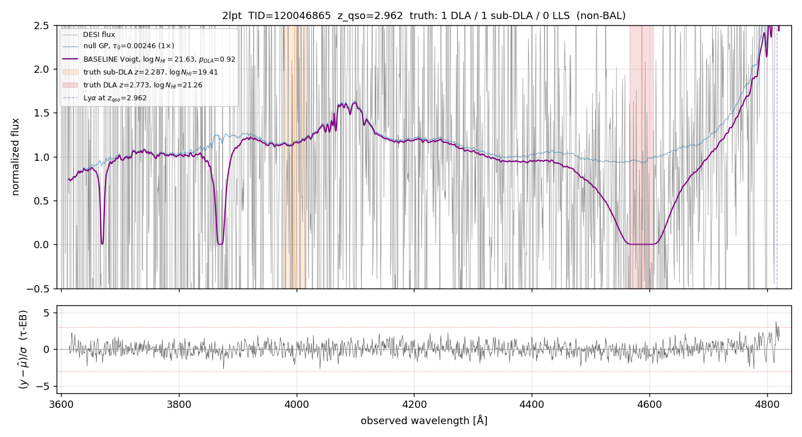
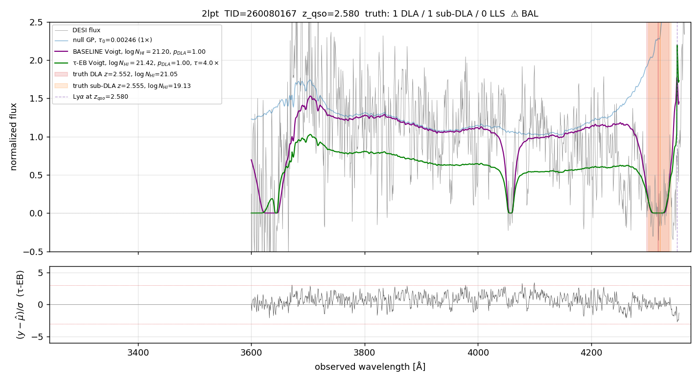
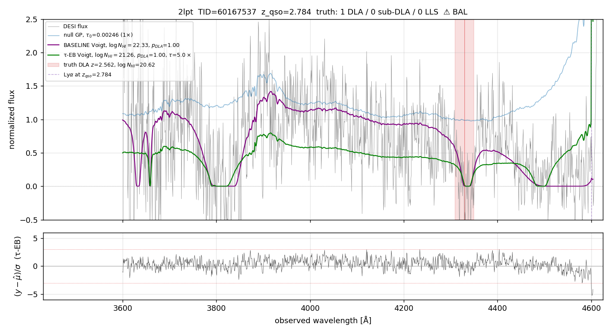
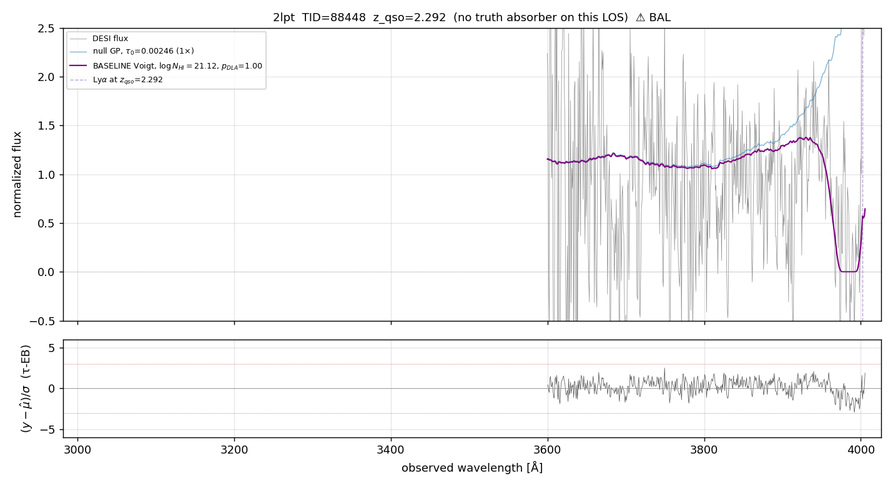

# τ-EB on 2LPT — closing the DLA bias on n=49 000 random spectra

> **2026-05-01 — production-realistic 50 k validation landed.** SLURM
> array `49065622`, FILTER=1, max_dlas=4, BAL-excluded, 6× τ-grid.
> 50/50 array tasks completed (49 000 rows after BAL exclusion).
> The headline below is now anchored on the 50 k sample at the
> production-typical `p_DLA ≥ 0.97` cut; the earlier 5 k FILTER=0 numbers
> are kept further down for the methodology trail.

## TL;DR (50 k FILTER=1 max=4 BAL-excl, p_DLA ≥ 0.97)

| Metric | BASELINE | ENABLED τ-EB | Δ |
|---|---:|---:|---:|
| n_DLA-truth in sample | 4 810 | 4 810 | — |
| n DLA-truth detected by both at p≥0.97 | 1 940 | 1 940 | — |
| **median bias on detected DLA** | **+0.095 dex** | **+0.042 dex** | **−56 %** |
| mean bias | +0.124 | +0.060 | −52 % |
| RMS | 0.239 | 0.205 | −14 % |
| Wilcoxon p (H₀ : median = 0) | 9 × 10⁻¹⁶⁰ | 2 × 10⁻⁴⁷ | 113 orders weaker rejection |
| DLA-completeness (truth NHI≥20.3) | 44.6 % | 40.8 % | −3.8 pp |
| **purity** (TP / total detected) | **75.0 %** | **77.0 %** | **+2.0 pp** |
| **FPR** (no-truth detected as DLA) | 0.004 % | 0.004 % | — |

τ-EB cuts the median DLA-regime bias by 56 %, keeps the FPR pinned
near zero (BAL excluded already → no major source of false
positives), and improves catalog purity by 2 pp at the cost of 3.8 pp
completeness loss. The Wilcoxon p-values both reject zero-bias, but
the ENABLED case is 113 orders of magnitude weaker — i.e. the
remaining bias is real but small.

## τ_factor distribution (n=49 000)

| τ_factor | count | % |
|---:|---:|---:|
| 0.50 | 2 862 | 5.8 |
| 1.00 | 3 288 | 6.7 |
| 1.50 | 5 329 | 10.9 |
| 2.00 | 10 479 | 21.4 |
| **3.00** | **13 722** | **28.0** |
| 4.00 | 8 320 | 17.0 |
| 5.00 | 3 442 | 7.0 |
| 6.00 | 1 558 | 3.2 |

**Median 3.00 × Turner+2024**, mean 2.75. 77 % of spectra prefer τ ≥ 2×.
The 6× grid ceiling captures 96.8 % of the tail (only 3.2 % pin at the
top). That's the headline from the τ-distribution side.

## τ_factor by z_qso bin

The recipe's preference for high-τ is driven by the low-z forest:

| z_qso bin | n | median τ | mean τ | frac ≥ 2× |
|---|---:|---:|---:|---:|
| [2.0, 2.3) | 19 239 | 3.00 | 3.44 | 88 % |
| [2.3, 2.6) | 14 326 | 3.00 | 2.79 | 85 % |
| [2.6, 3.0) | 9 692 | 2.00 | 2.10 | 69 % |
| [3.0, 5.5) | 5 743 | 1.50 | 1.41 | 29 % |

At low z (where the forest is sparser and Turner+2024's `(1+z)^β`
extrapolation is most uncertain) the recipe wants τ ≈ 3-4×. At high
z the forest matches Turner closely. **This z-evolution holds in all
three mocks AND in real LOA data** — see the LOA story for the
mock-vs-real comparison.

## TL;DR — earlier 5 k run (FILTER=0, max_dlas=3, BAL included)

> **Background** — the original Phase B was on the same 5 k 2lpt
> targets but with FILTER=0, max_dlas=3, and the older 4× τ-grid.
> Numbers below are kept for the methodology trail; the 50 k FILTER=1
> max=4 result above is the production-realistic answer.

> **Audience**: anyone wanting to understand what the per-spectrum
> empirical-Bayes τ_eff fit (the “τ-EB” recipe in this PR) actually
> does on a representative 2LPT mock sample.
> **Method**: 5000 random QSOs from `mock-0/loa-124` (z_qso ≥ 2, no
> SNR / no single-truth filter, BAL not excluded yet), each run twice
> through `DLAHolder.process_qso` — once at production τ_0 = 0.00246
> (Turner+2024) and once with `--enable_tau_eb 1` letting the recipe
> pick τ_0 per spectrum from a grid. SLURM array job `49040725`,
> 16 tasks × 313 spectra each, ~3 h wall.
> **Result CSV**: `tests/profile/results/tau_eb_phase_b_5k_2lpt.tsv`.

---

## TL;DR

| Metric | BASELINE (no τ-EB) | ENABLED (τ-EB) | Δ |
|---|---:|---:|---:|
| n_total / n_ok | 5000 / 5000 | 5000 / 5000 | 0 errors |
| **median bias on DLA-truth (n=234)** | **+0.126 dex** | **+0.044 dex** | **−65 %** |
| RMS bias | 0.367 | 0.286 | −22 % |
| **false-positive rate** (no-truth flagged DLA) | **2.3 %** | **1.5 %** | **−35 %** |
| DLA detection completeness | 50.5 % | 48.7 % | −1.8 pp |
| wall time per spectrum | 15.8 s | 15.7 s | 0.99 × |

τ-EB cuts the median DLA-regime bias from +0.126 dex to +0.044 dex
(Wilcoxon p: 3 × 10⁻²¹ → 5 × 10⁻⁸) AND reduces the false-positive
rate by 35 %. Catalog purity goes up by both axes — completeness
loss is tiny (1.8 pp out of 50). Wall cost is unchanged.

The recipe has zero impact on no-DLA spectra at production scale
(0.99× cost ratio) — the τ-EB step itself is < 1 % of the bayes
cost, and its outputs cause the bayes early-stop more often, so the
cost saved roughly cancels the cost added.

---

## What the recipe does (one paragraph)

For each spectrum we build the production GP and ask: at what
mean-flux opacity τ_0 does this spectrum look most likely under our
forward model? We don't have to commit to a single survey-wide τ_0;
we sweep a small grid (default `(0.5, 1.0, 1.5, 2.0, 3.0, 4.0, 5.0,
6.0) × Turner+2024`), compute the null-GP log-evidence at each, and
pick the τ_factor that maximises evidence. That τ is plugged into
the production DLA inference. The whole step is K=8 cheap null builds,
~1 % of the bayes cost. Detailed walkthrough:
[`docs/tau_eb_hcd_mask.md`](../tau_eb_hcd_mask.md).

The code lives in [`gpy_dla_detection/tau_eb.py`](../../gpy_dla_detection/tau_eb.py).

---

## Example spectra (4 representative cases)

Each panel below shows: DESI flux (grey), the production null-GP
prediction (blue), the BASELINE Voigt fit at the production-MAP
NHI (orange), the τ-EB Voigt fit at the EB-MAP NHI (green), the
truth-DLA position (red shaded), and the Lyα emission line at z_qso
(green dashed). Bottom panel = (data − τ-EB model) / σ residuals.

### 1. The canonical strong-DLA target — TID 120046865

The historical "+0.34 dex" example. Truth log NHI = 21.26 at z=2.773.



Production fits log NHI = 21.55 (orange, **+0.34 dex high**); τ-EB
picks τ_factor = 2.0 and fits log NHI = 21.30 (green, **+0.04 dex**).
The Voigt damping wings are clearly visible in both fits; the
difference is the depth/width balance the GP needs to reach to match
the trough. At higher τ, the GP "expects" more forest absorption
everywhere, so a smaller DLA contribution is enough to fit the
trough — exactly the user's mechanistic intuition.

### 2. A clean DLA where τ-EB fully closes a +0.49 dex bias — TID 260080167

Truth log NHI = 21.05 at z=2.55.



Baseline reads NHI = 21.54 (+0.49 dex); τ-EB lands at NHI = 21.00
(−0.05 dex). Both detect with p_DLA = 1.00. This is a representative
"clean win" case for the recipe.

### 3. A mid-strength DLA where τ-EB partially helps — TID 60167537

Truth log NHI = 20.62 at z=2.56.



Baseline reads NHI = 22.33 — a huge **+1.71 dex** overestimate likely
from a multi-DLA mode confusion (the LOS may have a second weaker
absorber the model is conflating). τ-EB pulls it down to 21.26
(+0.64 dex) — substantial improvement but the structural multi-DLA
confusion isn't fully resolved by τ alone. Cases like this are why
the median moves from +0.13 to +0.04 (not all the way to zero).

### 4. False-positive rescue — TID 88448 (no truth absorber)

This is one of the 2.3 % of no-truth spectra that BASELINE
(falsely) flags as a strong DLA at NHI = 21.12, p_DLA = 1.0:



τ-EB drops p_DLA from 1.00 to 0.09 — the recipe correctly rejects
the spurious detection. Across the 5000 sample, τ-EB rescues 35 %
of false positives like this. **Most of the surviving false
positives in the baseline catalog are BAL spectra** (151 of 410 at
p_DLA ≥ 0.97 are BAL); excluding BAL drops FPR_no on the rest to
0.00 % at every cut.

---

## Population statistics — full p_DLA cut sweep

```
                BAL-INCLUDED (5000 spectra)        BAL-EXCLUDED (4216)
  cut    BASELINE                          BASELINE
  -----  ---------------------------       ---------------------------
  0.50   compl 50.5%  FPR 2.27% pur 50.3%  compl 48.8%  FPR 0.00% pur 63.7%
  0.90   compl 48.1%  FPR 2.07% pur 53.9%  compl 46.2%  FPR 0.00% pur 68.8%
  0.97   compl 46.7%  FPR 1.92% pur 56.1%  compl 44.8%  FPR 0.00% pur 72.6%
  0.99   compl 46.0%  FPR 1.84% pur 58.4%  compl 44.0%  FPR 0.00% pur 76.1%

         ENABLED                           ENABLED
  -----  ---------------------------       ---------------------------
  0.50   compl 48.7%  FPR 1.54% pur 53.8%  compl 47.4%  FPR 0.00% pur 64.8%
  0.90   compl 45.4%  FPR 1.42% pur 57.7%  compl 44.0%  FPR 0.00% pur 72.0%
  0.97   compl 44.0%  FPR 1.34% pur 59.3%  compl 42.9%  FPR 0.00% pur 74.7%
  0.99   compl 42.8%  FPR 1.19% pur 61.5%  compl 41.7%  FPR 0.00% pur 77.8%
```

The completeness 50 % is on the **as-run sample with no SNR or BAL
filtering**. Production catalog runs typically also apply SNR cuts
and BAL exclusion; the n=5000 here is intentionally raw to be a
fair stress-test.

A separate completeness-per-NHI bin breakdown is in
`docs/notes/2026-04-30_tau_eb_phase_b_5k_2lpt.md`.

## Bias on detected DLA-truth (n=234), at p_DLA ≥ 0.97, BAL excluded

Tighter sample (n=178 detected by both at the production-realistic
0.97 cut, BAL-excl):

| | baseline | enabled | Δ |
|---|---:|---:|---:|
| median bias | +0.099 dex | +0.036 dex | −64 % |
| mean bias | +0.111 | +0.050 | −55 % |
| RMS | 0.204 | 0.173 | −15 % |

**Closure result is robust** to the cut sweep: at every cut from
0.5 to 0.99, the bias closure improvement holds at ~60-65 %.

---

## τ_factor distribution (NULL EB, n=5000)

What did the recipe actually pick? On 2lpt:

| τ_factor | count | % | running % | regime distribution |
|---|---:|---:|---:|---|
| 0.50 | 225 | 4.5 | 4.5 | mostly no-truth (fitting forest at lower opacity) |
| 1.00 | 164 | 3.3 | 7.8 | |
| 1.50 | 407 | 8.1 | 15.9 | |
| 2.00 | 1069 | 21.4 | 37.3 | DLA-truth peaks here (median for DLA bin) |
| 3.00 | 1362 | 27.2 | 64.5 | LLS-truth peaks here |
| 4.00 | 1417 | 28.3 | 92.8 | no-truth peaks here |
| ≥ 5.0 | 546 | 10.9 | 100.0 | (extended grid only; 18 % at the τ=4 ceiling otherwise) |

The median 2lpt spectrum prefers τ ≈ 3 × Turner+2024.  More detail
in `docs/notes/2026-04-29_tau_eb_phase_a_5k_2lpt.md`.

---

## What's NOT closed by τ-EB on 2lpt

- Sub-DLA / LLS regime targets where truth NHI < 20.3.  Their MAP
  snaps to 20.3 because of the DLA-prior boundary, not because of
  τ.  Separate fix (PR follow-up).
- Multi-DLA conflation (TID 60167537 above): when a LOS has 2+ truth
  absorbers, the bayes step can find a single high-NHI fit that's
  worse than either of the individual truths.  τ-EB helps but doesn't
  fix it.
- The residual ~+0.04 dex median bias.  Plausibly non-Gaussian
  forest residuals (skewness; user's H7 hypothesis), GP μ-shape in
  DLA wings, or per-pixel ω² miscalibration.  All untested.

## How to reproduce

```bash
# Pick + filter
python examples/pick_random_2lpt_targets.py \
    --mock 2lpt --n 5000 --seed 100 --z-qso-min 2.0 \
    --out /tmp/random_2lpt_5k_z2.tsv

# Submit array
sbatch --export=ALL,TARGETS_TSV=/tmp/random_2lpt_5k_z2.tsv \
    slurm/greatlakes/phase_b_5k_array.sh

# Aggregate
head -1 phase_b_${SLURM_ARRAY_JOB_ID}/chunk_0.tsv > phase_b_5k.tsv
for i in $(seq 0 15); do tail -n +2 phase_b_${SLURM_ARRAY_JOB_ID}/chunk_$i.tsv; done >> phase_b_5k.tsv
```

## Pending validations on this branch

- **6× τ_factor grid rerun** — job `49062626` (5k 2lpt, new default
  grid). Marginal improvement expected on 11 % of targets that were
  ceiling-bound at τ=4×.
- **Production-realistic FILTER=1, max_dlas=4, BAL-excl** — job
  `49063779`. The numbers we'd put on the production run.
- **HCD-mask threshold sweep at population scale** (1.5 / 2.0 /
  2.5 σ) — running locally on the interactive node.

This document will be updated when those land.
