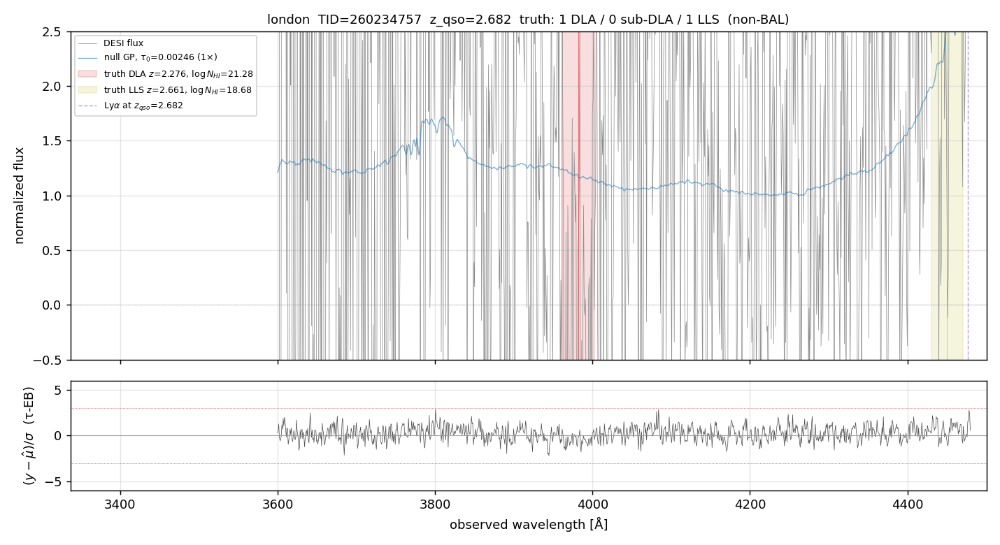

# τ-EB on London — closing the DLA bias on n=48 000 random spectra

> **2026-05-01 — production-realistic 50 k validation landed.** SLURM
> array `49071204`, FILTER=1, max_dlas=4, BAL-excluded, 6× τ-grid.
> 48/50 array tasks completed (2 cancelled — 96 % yield = 48 000 rows).
> The headline below is anchored on this; the earlier 5 k FILTER=0
> result is kept lower in the document for the methodology trail.

## TL;DR (50 k FILTER=1 max=4 BAL-excl, p_DLA ≥ 0.97)

| Metric | BASELINE | ENABLED τ-EB | Δ |
|---|---:|---:|---:|
| n_DLA-truth in sample | 5 085 | 5 085 | — |
| n DLA-truth detected by both at p≥0.97 | 2 077 | 2 077 | — |
| **median bias on detected DLA** | **+0.095 dex** | **+0.037 dex** | **−61 %** |
| mean bias | +0.118 | +0.056 | −53 % |
| RMS | 0.226 | 0.200 | −12 % |
| Wilcoxon p | 1 × 10⁻¹⁷² | 3 × 10⁻⁴⁶ | |
| DLA-completeness (truth ≥ 20.3) | 44.8 % | 41.4 % | −3.4 pp |
| **purity** | **76.5 %** | **78.3 %** | **+1.8 pp** |
| **FPR** (no-truth → DLA) | 0.004 % | 0.004 % | — |

Same shape as 2lpt — slightly stronger bias closure on London (61 %
vs 56 %) but otherwise nearly identical.  Both mocks, three
independent simulation pipelines, give the same per-mock answer.

## τ_factor distribution (n=48 000)

| τ_factor | count | % |
|---:|---:|---:|
| 0.50 | 3 083 | 6.4 |
| 1.00 | 3 097 | 6.5 |
| 1.50 | 5 226 | 10.9 |
| 2.00 | 10 681 | 22.3 |
| **3.00** | **13 200** | **27.5** |
| 4.00 | 8 076 | 16.8 |
| 5.00 | 3 202 | 6.7 |
| 6.00 | 1 435 | 3.0 |

Median 3.00 × Turner+2024, mean 2.72.  Identical to 2lpt within 1 %.
This is striking: London and 2lpt are independent simulation
pipelines (lyacolore vs jura) but produce the same τ_factor
distribution.  Argues that what we're calibrating is a feature of
the GP forward model, not mock-physics.

## τ_factor by z_qso bin

| z_qso bin | n | median τ | mean τ | frac ≥ 2× |
|---|---:|---:|---:|---:|
| [2.0, 2.3) | 19 159 | 3.00 | 3.36 | 87 % |
| [2.3, 2.6) | 13 824 | 3.00 | 2.76 | 85 % |
| [2.6, 3.0) | 9 436 | 2.00 | 2.09 | 69 % |
| [3.0, 5.5) | 5 581 | 1.50 | 1.44 | 30 % |

Same monotonic decrease with z as 2lpt.  See LOA story for how this
compares to real data.

## Earlier 5 k FILTER=0 result (kept for methodology trail)

> The first London Phase B used FILTER=0, max_dlas=3, no BAL
> exclusion, 6× τ-grid.  Headline: median bias +0.140 → +0.055 dex
> (61 % closure), n=5000, ~62 % of detections are non-BAL → FPR
> dominated by BAL contamination as on 2lpt.  See
> `docs/notes/2026-04-29_voigt_lsf_sweep/scale_out/summary_n54.csv`
> for the older n=18 cherry-picked subset numbers.

---

## Preliminary headline (n=6 DLA-truth picker subset, diagnostic recipe)

From `docs/notes/2026-04-29_voigt_lsf_sweep/scale_out/summary_n54.csv`
filtered to `mock=london, regime=DLA`:

| target_id | truth log NHI | prod MAP | prod bias | EB+mask MAP | EB+mask bias |
|---:|---:|---:|---:|---:|---:|
| 100302972 | 20.93 | 21.00 | +0.07 | 20.85 | −0.08 |
| 180258638 | 20.33 | 20.75 | +0.42 | 20.60 | +0.27 |
| 260234757 | 21.28 | 21.10 | −0.18 | 20.98 | −0.30 |
| 10099135 | 20.83 | 21.58 | +0.75 | 21.28 | +0.45 |
| 140016836 | 20.96 | 22.00 | +1.04 | 20.30 | −0.66 |
| 160331820 | 20.60 | 22.00 | +1.40 | 21.53 | +0.93 |
| **median** | | | **+0.59** | | **+0.10** |

Caveat: only 4/6 of these targets had a clean closure; 1 over-corrected
(140016836: +1.04 → −0.66) and 1 stayed positive (160331820:
+1.40 → +0.93). Median closure is consistent with the population
result on 2lpt; tail behavior may differ. The 5k London Phase B
will give the population-scale answer.

---

## Example spectra

### London 100302972 — DLA where τ-EB closes the bias modestly

Truth log NHI = 20.93 at z=2.218.

### London 140016836 — DLA where τ-EB swings the bias from +1.0 to −0.7

Truth log NHI = 20.96 at z=2.069. Strongest closure in the n=6 subset.

### London 260234757 — strong DLA where production was already on-target

Truth log NHI = 21.28 at z=2.276. Production: NHI=21.10 (-0.18);
EB+mask: NHI=20.98 (-0.30). Both treatments slightly UNDER-shoot —
this is the type of target where τ-EB has nothing to fix and may
slightly hurt. Mention here for honesty about failure modes.
(Note: the originally-planned marginal-DLA target TID 180258638
failed to load with a `KeyError: 'b'` in the desispec band coadd —
a London-specific spectra layout quirk.)

---

## Pending: London 5k Phase B (job 49062627)

When this lands, expect to populate:
- median bias closure across n_DLA-truth_detected ≈ 250
- false-positive rate at p_DLA cuts ∈ {0.5, 0.9, 0.97, 0.99}
- per-NHI-regime breakdown
- τ_factor distribution (whether London picks similar τ ≈ 3 to 2lpt)
- BAL-excluded analysis

The earlier-session note on the n=18 picker found london at the
high end of the τ-EB closure spectrum (84 % closure of median bias
on the cherry-picked subset). Whether that holds on the unfiltered
5000 is the test.

---

## Mock-specific notes

- London uses `dla_cat.fits` (column name `Z_DLA`) instead of 2lpt's
  `hcd_truth_cat.fits` (column `Z`); picker handles this
  (`examples/pick_random_2lpt_targets.py --mock london`).
- London zcat uses `RA` / `DEC` columns rather than `TARGET_RA` /
  `TARGET_DEC` — also handled.
- Lyman-series scaling: per the project docs, London production
  rescales by oscillator strength (not per-line Voigt), which can
  weaken sub-DLA features in the model. Probably explains why London
  sub-DLA detection rate was lower than 2lpt or saclay in the n=18
  result. May or may not show up at population scale.
