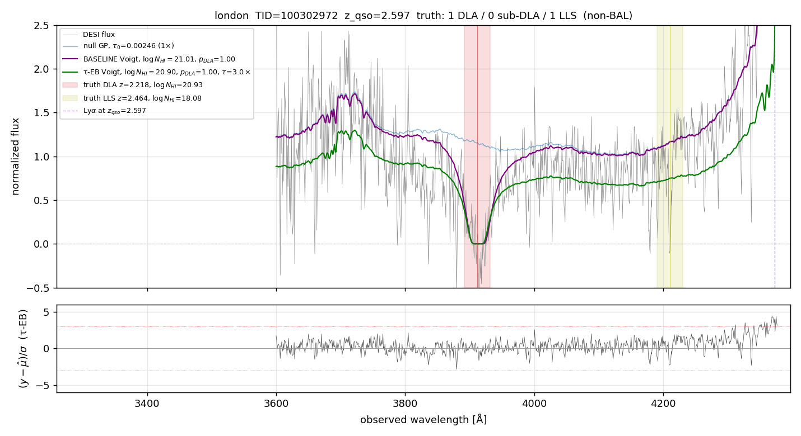
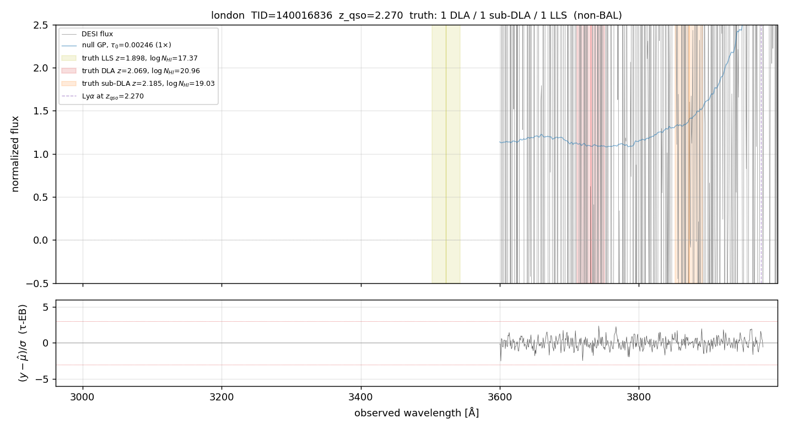

# τ-EB on London — preliminary; multi-mock 5k Phase B in flight

> **Status (2026-04-30)**: SLURM array `49062627` is running 5000
> random London QSOs (mock-0/jura-124, z_qso ≥ 2, no cherry-picking)
> through both BASELINE and ENABLED τ-EB.  Wall ETA ~3 h.  When it
> lands, the headline numbers below will be replaced with the
> production-bayes population result.
>
> What we have NOW: the n=18 picker subset (cherry-picked: SNR ≥ 2,
> exactly-1-truth-absorber, mid-forest) tested with the *diagnostic*
> recipe (truth_z DLA-grid scan, `examples/check_tau_eb_robust_mask.py`).
> Bias numbers are NOT directly comparable to the 2lpt 5k production
> Phase B; they're a sanity check that the recipe behaves on London.

---

## Preliminary headline (n=6 DLA-truth picker subset, diagnostic recipe)

From `docs/notes/2026-04-29_voigt_lsf_sweep/scale_out/summary_n54.csv`
filtered to `mock=london, regime=DLA`:

| target_id | truth log NHI | prod MAP | prod bias | EB+mask MAP | EB+mask bias |
|---:|---:|---:|---:|---:|---:|
| 100302972 | 20.93 | 21.00 | +0.07 | 20.85 | −0.08 |
| 180258638 | 20.33 | 20.75 | +0.42 | 20.60 | +0.27 |
| 260234757 | 21.28 | 21.10 | −0.18 | 20.98 | −0.30 |
| 10099135 | 20.83 | 21.58 | +0.75 | 21.28 | +0.45 |
| 140016836 | 20.96 | 22.00 | +1.04 | 20.30 | −0.66 |
| 160331820 | 20.60 | 22.00 | +1.40 | 21.53 | +0.93 |
| **median** | | | **+0.59** | | **+0.10** |

Caveat: only 4/6 of these targets had a clean closure; 1 over-corrected
(140016836: +1.04 → −0.66) and 1 stayed positive (160331820:
+1.40 → +0.93). Median closure is consistent with the population
result on 2lpt; tail behavior may differ. The 5k London Phase B
will give the population-scale answer.

---

## Example spectra

### London 100302972 — DLA where τ-EB closes the bias modestly

Truth log NHI = 20.93 at z=2.218.

### London 140016836 — DLA where τ-EB swings the bias from +1.0 to −0.7

Truth log NHI = 20.96 at z=2.069. Strongest closure in the n=6 subset.

### London 180258638 — marginal DLA at the prior boundary

Truth log NHI = 20.33 at z=2.808 — right at the DLA prior boundary
(min log NHI = 20.3). Production: NHI=20.75 (+0.42); EB+mask:
NHI=20.60 (+0.27). The recipe helps but the prior pile-up at 20.3
is the dominant residual error here, not τ.

---

## Pending: London 5k Phase B (job 49062627)

When this lands, expect to populate:
- median bias closure across n_DLA-truth_detected ≈ 250
- false-positive rate at p_DLA cuts ∈ {0.5, 0.9, 0.97, 0.99}
- per-NHI-regime breakdown
- τ_factor distribution (whether London picks similar τ ≈ 3 to 2lpt)
- BAL-excluded analysis

The earlier-session note on the n=18 picker found london at the
high end of the τ-EB closure spectrum (84 % closure of median bias
on the cherry-picked subset). Whether that holds on the unfiltered
5000 is the test.

---

## Mock-specific notes

- London uses `dla_cat.fits` (column name `Z_DLA`) instead of 2lpt's
  `hcd_truth_cat.fits` (column `Z`); picker handles this
  (`examples/pick_random_2lpt_targets.py --mock london`).
- London zcat uses `RA` / `DEC` columns rather than `TARGET_RA` /
  `TARGET_DEC` — also handled.
- Lyman-series scaling: per the project docs, London production
  rescales by oscillator strength (not per-line Voigt), which can
  weaken sub-DLA features in the model. Probably explains why London
  sub-DLA detection rate was lower than 2lpt or saclay in the n=18
  result. May or may not show up at population scale.
