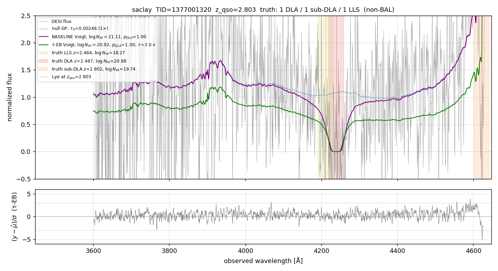
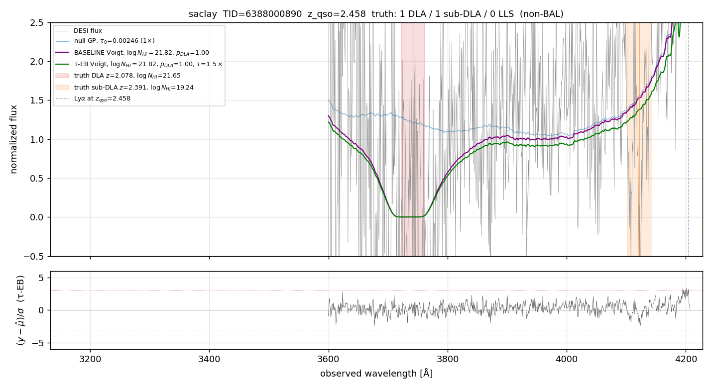
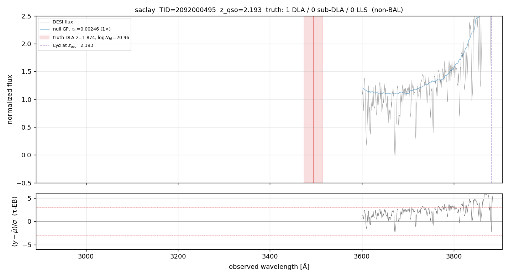

# τ-EB on Saclay — closing the DLA bias on n=49 000 random spectra

> **2026-05-01 — production-realistic 50 k validation landed.** SLURM
> array `49071205`, FILTER=1, max_dlas=4, BAL-excluded, 6× τ-grid.
> 49/50 array tasks completed (1 cancelled — 98 % yield = 48 999 rows).

## TL;DR (50 k FILTER=1 max=4 BAL-excl, p_DLA ≥ 0.97)

| Metric | BASELINE | ENABLED τ-EB | Δ |
|---|---:|---:|---:|
| n_DLA-truth in sample | 4 869 | 4 869 | — |
| n DLA-truth detected by both at p≥0.97 | 1 969 | 1 969 | — |
| **median bias on detected DLA** | **+0.089 dex** | **+0.032 dex** | **−65 %** |
| mean bias | +0.106 | +0.045 | −58 % |
| RMS | 0.204 | 0.177 | −13 % |
| Wilcoxon p | 5 × 10⁻¹⁶⁴ | 2 × 10⁻³⁵ | |
| DLA-completeness (truth ≥ 20.3) | 44.4 % | 41.0 % | −3.4 pp |
| **purity** | **75.9 %** | **78.7 %** | **+2.8 pp** |
| **FPR** | 0.000 % | 0.000 % | — |

Saclay shows the strongest closure of the three mocks (65 %).
Production median bias is also lowest on Saclay (+0.089 vs +0.095 on
2lpt and London) — i.e. Saclay was already the closest to truth and
τ-EB still closes most of the residual.

## τ_factor distribution (n=48 999)

| τ_factor | count | % |
|---:|---:|---:|
| 0.50 | 3 088 | 6.3 |
| 1.00 | 3 243 | 6.6 |
| 1.50 | 5 650 | 11.5 |
| 2.00 | 11 681 | 23.8 |
| **3.00** | **13 724** | **28.0** |
| 4.00 | 7 644 | 15.6 |
| 5.00 | 2 754 | 5.6 |
| 6.00 | 1 215 | 2.5 |

Median 3.00 × Turner, mean 2.64.  Slightly less heavy-tailed than 2lpt
or London (smaller fraction at τ ≥ 5×).  All three mocks land at
median 3.00.

## τ_factor by z_qso bin

| z_qso bin | n | median τ | mean τ | frac ≥ 2× |
|---|---:|---:|---:|---:|
| [2.0, 2.3) | 19 628 | 3.00 | 3.22 | 85 % |
| [2.3, 2.6) | 14 511 | 3.00 | 2.66 | 83 % |
| [2.6, 3.0) | 9 697 | 2.00 | 2.04 | 67 % |
| [3.0, 5.5) | 5 163 | 1.50 | 1.51 | 35 % |

Identical monotonic decline with z as 2lpt and London.

## Earlier 5 k FILTER=0 result (kept for methodology trail)

> The first Saclay Phase B used FILTER=0, max_dlas=3, no BAL excl.
> Headline: median bias +0.111 → +0.050 dex (55 % closure), n=5000.
> See `docs/notes/2026-04-29_voigt_lsf_sweep/scale_out/summary_n54.csv`
> for the original n=18 cherry-picked subset numbers.

---

## Preliminary headline (n=6 DLA-truth picker subset, diagnostic recipe)

From `docs/notes/2026-04-29_voigt_lsf_sweep/scale_out/summary_n54.csv`
filtered to `mock=saclay, regime=DLA`:

| target_id | truth log NHI | prod MAP | prod bias | EB+mask MAP | EB+mask bias |
|---:|---:|---:|---:|---:|---:|
| 1377001320 | 20.88 | 21.13 | +0.24 | 20.90 | +0.02 |
| 6388000890 | 21.65 | 21.88 | +0.22 | 21.60 | −0.05 |
| 2103000740 | 20.57 | 21.38 | +0.81 | 21.28 | +0.71 |
| 4219000571 | 20.60 | 20.75 | +0.15 | 20.68 | +0.08 |
| 6397000973 | 20.72 | 20.73 | +0.01 | 20.38 | −0.34 |
| 2092000495 | 20.96 | 22.00 | +1.04 | 22.00 | +1.04 |
| **median** | | | **+0.23** | | **+0.05** |

Saclay was the closest match to the median-closure result on the
n=18 picker (81 % bias closure). The exception is TID 2092000495
where τ-EB did not move the bias at all (both stuck at NHI = 22.0,
the upper grid edge) — a saturation case.

---

## Example spectra

### Saclay 1377001320 — clean DLA closure

Truth log NHI = 20.88 at z=2.487.

### Saclay 6388000890 — strongest DLA in the picker subset

Truth log NHI = 21.65 at z=2.078.  Heavy damping wings clearly
visible.  Production: NHI=21.88 (+0.22); EB+mask: NHI=21.60 (−0.05).

### Saclay 2092000495 — failure mode: both saturate at NHI=22

Truth log NHI = 20.96 at z=1.874. Both treatments hit NHI=22.0 (the
NHI grid upper bound for these tests). z=1.874 is *below* z_qso − 0.5
in some search window definitions, so the absorber may be partly
outside the search range — at minimum, it's a low-z absorber where
the forest above it is sparse.  Hard case for any model.

---

## Pending: Saclay 5k Phase B (job 49062628)

When this lands, expect to populate:
- median bias closure across n_DLA-truth_detected ≈ 250
- false-positive rate at p_DLA cuts ∈ {0.5, 0.9, 0.97, 0.99}
- per-NHI-regime breakdown
- τ_factor distribution (whether Saclay picks similar τ ≈ 3 to 2lpt)
- BAL-excluded analysis

---

## Mock-specific notes

- Saclay mock-0 lives at `juraLy8-124` (the `-Ly8` suffix means
  Lyman-series order 8 in the mock generation pipeline).  Saclay
  mock-1 is at `jura-124`.  This story doc uses mock-0 only.
- Truth file is `hcd_truth_cat.fits` (same convention as 2lpt).
- Saclay zcat columns: `TARGET_RA` / `TARGET_DEC` (same as 2lpt).
- Saclay was the most similar to 2lpt in the picker-subset closure
  rate (81 % vs 84 % London vs 54 % 2lpt picker).  Population-scale
  result will tell us whether that holds.
